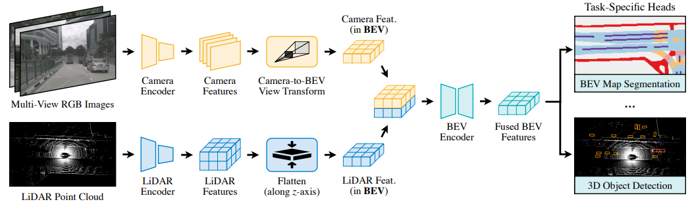
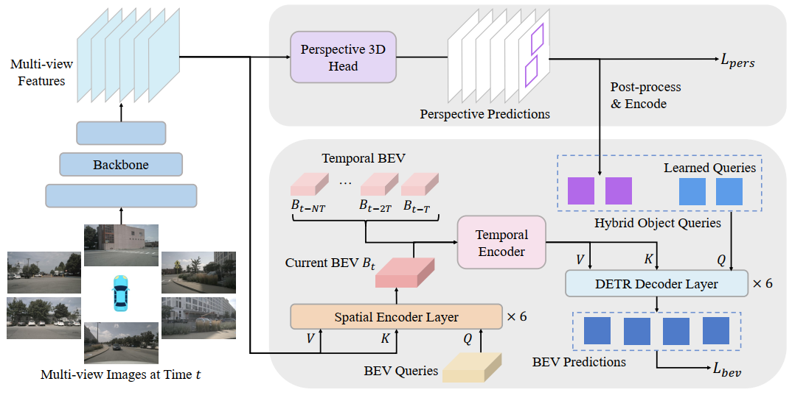
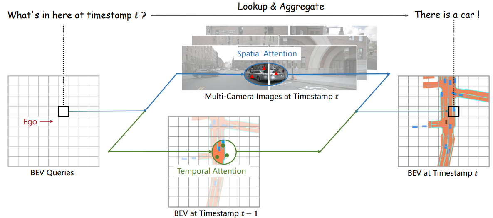

# Knowledge Graph

|No.   |Figure   |Title   |Pub.  |Links|
|-----|:-----:|:-----:|:-----:|:---:|
|3||__BEVFusion: Multi-Task Multi-Sensor Fusion with Unified Bird’s-Eye View Representation__|__ICRA 2023__|[`Paper`](https://openaccess.thecvf.com/content/CVPR2023/papers/Yang_BEVFormer_v2_Adapting_Modern_Image_Backbones_to_Birds-Eye-View_Recognition_via_CVPR_2023_paper.pdf) [`Project`](https://bevfusion.mit.edu/) [`Code`](https://github.com/mit-han-lab/bevfusion) |
|2||__BEVFormer v2: Adapting Modern Image Backbones to Bird’s-Eye-View Recognition via Perspective Supervision__|__CVPR 2023__|[`Paper`](https://openaccess.thecvf.com/content/CVPR2023/papers/Yang_BEVFormer_v2_Adapting_Modern_Image_Backbones_to_Birds-Eye-View_Recognition_via_CVPR_2023_paper.pdf)  |
|1||__BEVFormer: Learning Bird's-Eye-View Representation from Multi-Camera Images via Spatiotemporal Transformers__|__ECCV 2022__|[`Paper`](https://arxiv.org/abs/2203.17270) [`Code`](https://github.com/fundamentalvision/BEVFormer)  |

