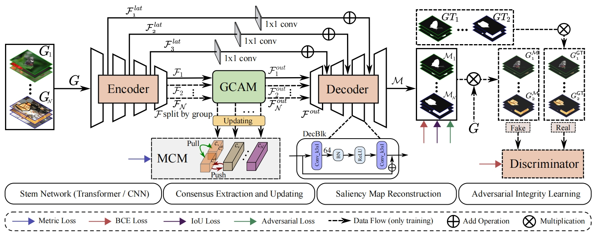
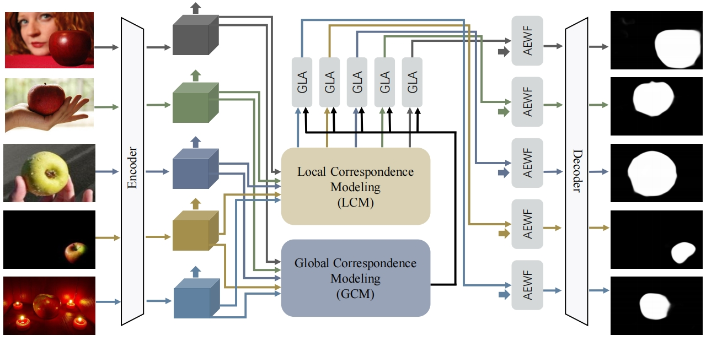
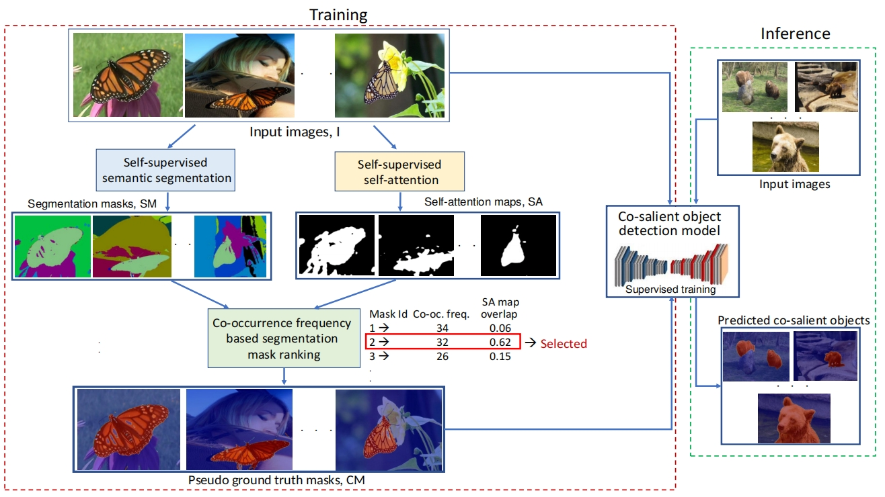
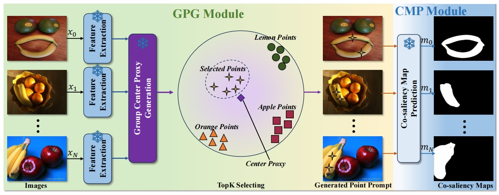
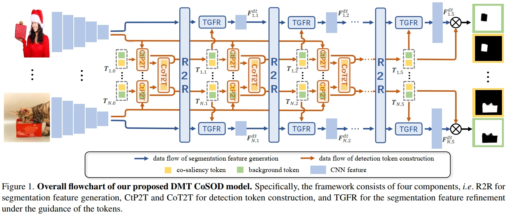

# Cross Model

|No.   |Figure   |Title   |Pub.  |Link|
|:----|:-----:|:-----:|:-----:|:---:|
|9||__Towards Open-World Co-Salient Object Detection with Generative Uncertainty-aware Group Selective Exchange-Masking__|__ECCV 2024__|[`Paper`](https://arxiv.org/pdf/2310.10264) [`Github`](https://github.com/wuyang98/CoSOD) |
|8||__Memory-aided Contrastive Consensus Learning for Co-salient Object Detection__|__AAAI 2023__|[`Paper`](https://arxiv.org/abs/2302.14485) [`Github`](https://github.com/ZhengPeng7/MCCL) |
|7||__Global-and-Local Collaborative Learning for Co-Salient Object Detection__|__TRANSCyber 2022__|[`Paper`](https://arxiv.org/abs/2204.08917) [`Github`](https://rmcong.github.io/proj_GLNet.html) |
|6||__Unsupervised and semi-supervised co-salient object detection via segmentation frequency statistics__|__WACV 2024__|[`Paper`](https://openaccess.thecvf.com/content/WACV2024/papers/Chakraborty_Unsupervised_and_Semi-Supervised_Co-Salient_Object_Detection_via_Segmentation_Frequency_Statistics_WACV_2024_paper.pdf) [`Github`](https://github.com/sourachakra/uscosod-sscosod) |
|5||__ZERO-SHOT CO-SALIENT OBJECT DETECTION FRAMEWORK__|__ICASSP 2024__|[`Paper`](https://arxiv.org/abs/2309.05499) [`Github`](https://github.com/hkxiao/zs-cosod) |
|4||__Discriminative Co-Saliency and Background Mining Transformer for Co-Salient Object Detection__|__CVPR 2023__|[`Paper`](https://arxiv.org/abs/2305.00514) [`Github`](https://github.com/dragonlee258079/DMT) |
|3||__ICNet: Intra-saliency Correlation Network for Co-Saliency Detection__|__NIPS 2020__|[`Paper`](https://proceedings.neurips.cc/paper/2020/file/d961e9f236177d65d21100592edb0769-Paper.pdf) [`Github`]( https://github.com/blanclist/ICNet) |
|2||__Summarize and Search: Learning Consensus-aware Dynamic Convolution for Co-Saliency Detection__|__ICCV 2021__|[`Paper`](https://openaccess.thecvf.com/content/ICCV2021/papers/Zhang_Summarize_and_Search_Learning_Consensus-Aware_Dynamic_Convolution_for_Co-Saliency_Detection_ICCV_2021_paper.pdf) [`Github`](https://github.com/nnizhang/CADC) |
|1||__Democracy Does Matter: Comprehensive Feature Mining for Co-Salient Object Detection__|__CVPR 2022__|[`Paper`](https://arxiv.org/abs/2203.05787) [`Github`]( https://github.com/siyueyu/DCFM) |

