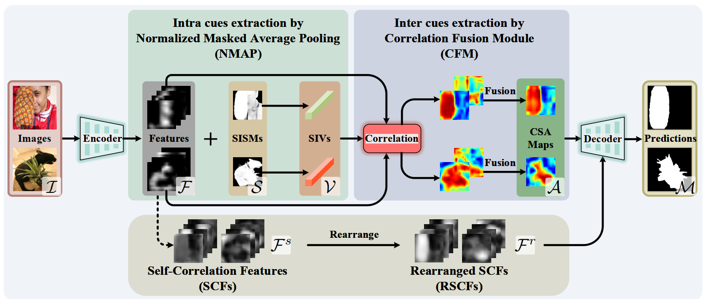
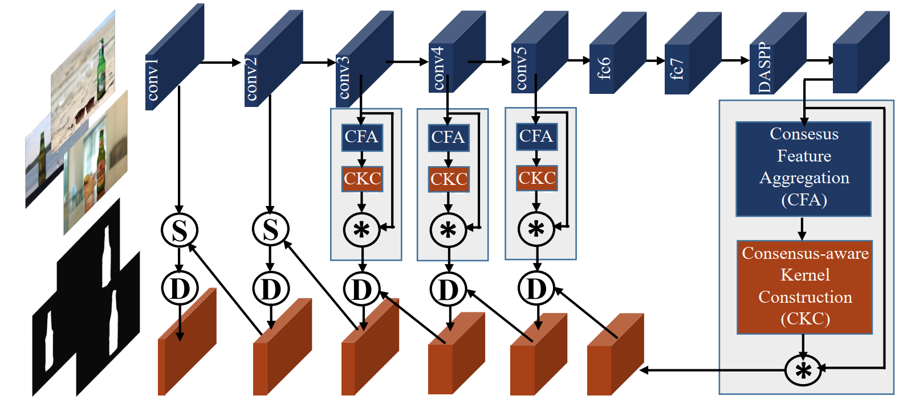
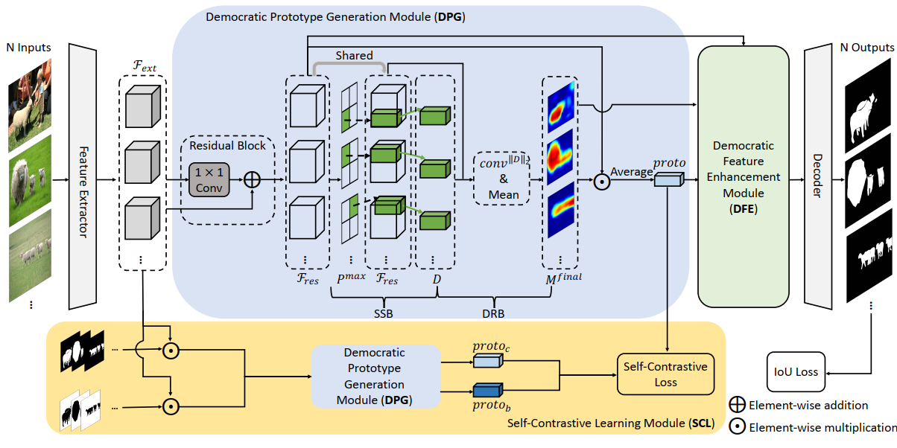

# Cross Model

|No.   |Figure   |Title   |Pub.  |Link|
|:----|:-----:|:-----:|:-----:|:---:|
|3||__ICNet: Intra-saliency Correlation Network for Co-Saliency Detection__|__NIPS 2020__|[`Paper`](https://proceedings.neurips.cc/paper/2020/file/d961e9f236177d65d21100592edb0769-Paper.pdf) [`Github`]( https://github.com/blanclist/ICNet) |
|2||__Summarize and Search: Learning Consensus-aware Dynamic Convolution for Co-Saliency Detection__|__ICCV 2021__|[`Paper`](https://openaccess.thecvf.com/content/ICCV2021/papers/Zhang_Summarize_and_Search_Learning_Consensus-Aware_Dynamic_Convolution_for_Co-Saliency_Detection_ICCV_2021_paper.pdf) [`Github`](https://github.com/nnizhang/CADC) |
|1||__Democracy Does Matter: Comprehensive Feature Mining for Co-Salient Object Detection__|__CVPR 2022__|[`Paper`](https://arxiv.org/abs/2203.05787) [`Github`]( https://github.com/siyueyu/DCFM) |

