# Cross Modal

|No.   |Figure   |Title   |Pub.  |Link|         
|:----|:-----:|:-----:|:-----:|:---:|
|54|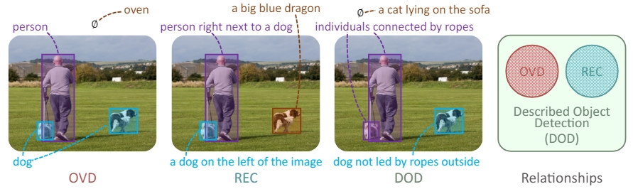|__Described Object Detection: Liberating Object Detection with Flexible Expressions__|__NeurIPS 2023__|[`Paper`](https://arxiv.org/pdf/2307.12813) [`Github`](https://github.com/shikras/d-cube)|
|53|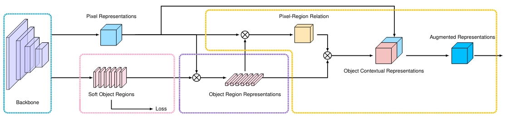|__Object-Contextual Representations for Semantic Segmentation__|__ECCV 2020__|[`Paper`](https://arxiv.org/abs/1909.11065) [`Github`](https://github.com/HRNet/HRNet-Semantic-Segmentation/tree/HRNet-OCR)|
|52|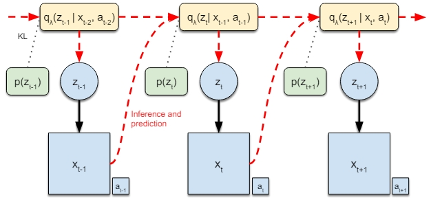|__PARTS: Unsupervised segmentation with slots, attention and independence maximization__|__ICCV 2021__|[`Paper`](https://openaccess.thecvf.com/content/ICCV2021/papers/Zoran_PARTS_Unsupervised_Segmentation_With_Slots_Attention_and_Independence_Maximization_ICCV_2021_paper.pdf) [`Github`](https://github.com/wu375/parts-segmentation)|
|51|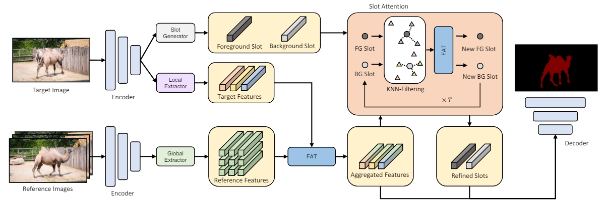|__Guided Slot Attention for Unsupervised Video Object Segmentation__|__CVPR 2024__|[`Paper`](https://arxiv.org/pdf/2303.08314) [`Github`](https://github.com/Hydragon516/GSANet)|
|50|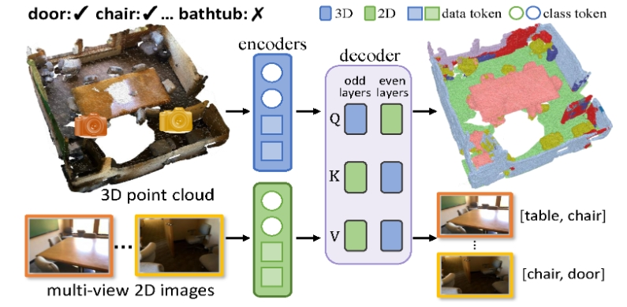|__2D-3D Interlaced Transformer for Point Cloud Segmentation with Scene-Level Supervision__|__ICCV 2023__|[`Paper`](https://openaccess.thecvf.com/content/ICCV2023/papers/Yang_2D-3D_Interlaced_Transformer_for_Point_Cloud_Segmentation_with_Scene-Level_Supervision_ICCV_2023_paper.pdf) [`Github`](https://jimmy15923.github.io/mit_web/)|
|49|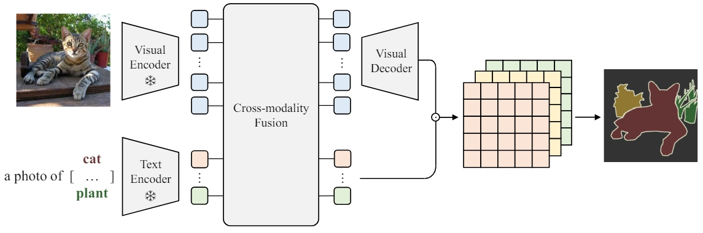|__Open-vocabulary Semantic Segmentation with Frozen Vision-Language Models__|__BMVC 2022__|[`Paper`](https://arxiv.org/abs/2210.15138) [`Github`](https://github.com/chaofanma/Fusioner?tab=readme-ov-file)|
|48|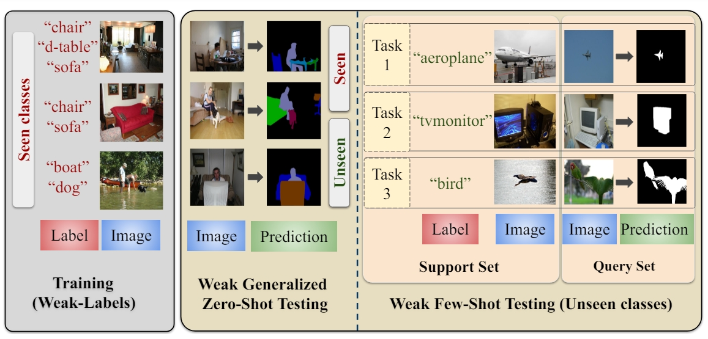|__A Language-Guided Benchmark for Weakly Supervised Open Vocabulary Semantic Segmentation__|__arxiv 2023__|[`Paper`](https://arxiv.org/abs/2302.14163) [`Github`](https://github.com/mustafa1728/wlsegnet)|
|47|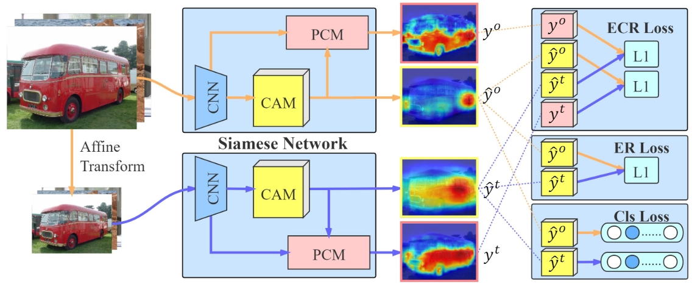|__Self-supervised Equivariant Attention Mechanism for Weakly Supervised Semantic Segmentation__|__CVPR 2020__|[`Paper`](https://openaccess.thecvf.com/content_CVPR_2020/papers/Wang_Self-Supervised_Equivariant_Attention_Mechanism_for_Weakly_Supervised_Semantic_Segmentation_CVPR_2020_paper.pdf) [`Github`](https://github.com/YudeWang/SEAM)|
|46|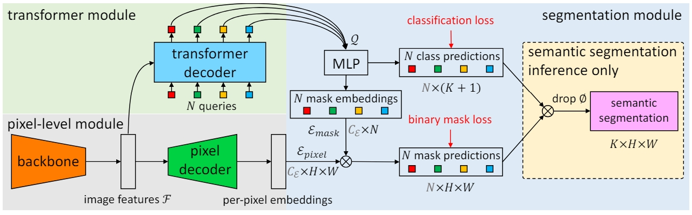|__MaskFormer: Per-Pixel Classification is Not All You Need for Semantic Segmentation__|__NeurIPS 2021__|[`Paper`](https://arxiv.org/abs/2107.06278) [`Github`](https://github.com/facebookresearch/MaskFormer)|
|45|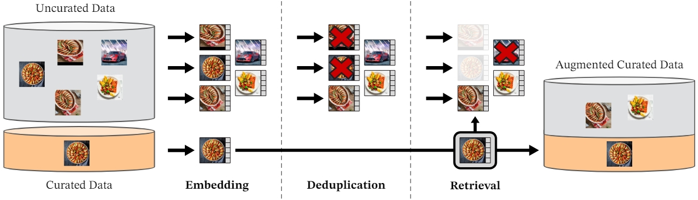|__DINOv2: Learning Robust Visual Features without Supervision__|__TMLR 2024__|[`Paper`](https://arxiv.org/abs/2304.07193) [`Github`](https://github.com/facebookresearch/dinov2)|
|44|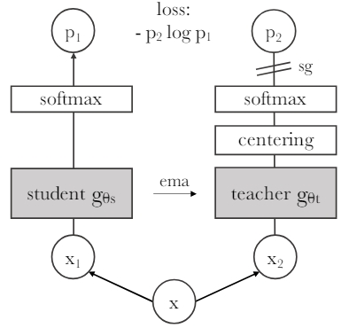|__Emerging Properties in Self-Supervised Vision Transformers (Self-Supervised Vision Transformers with DINO)__|__ICCV 2021__|[`Paper`](https://openaccess.thecvf.com/content/ICCV2021/papers/Caron_Emerging_Properties_in_Self-Supervised_Vision_Transformers_ICCV_2021_paper.pdf) [`Github`](https://github.com/facebookresearch/dino)|
|43|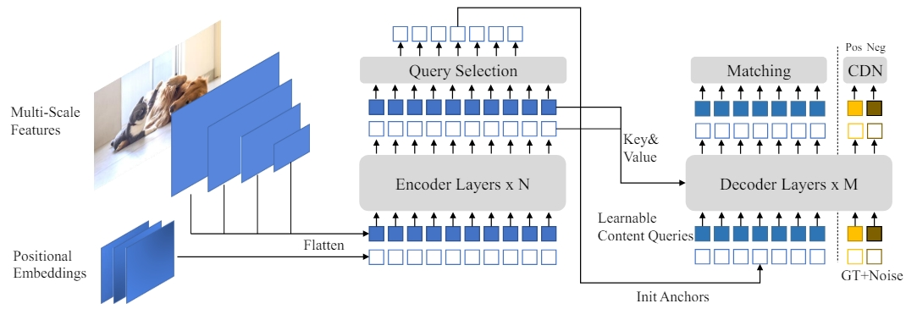|__DINO: DETR with Improved DeNoising Anchor Boxes for End-to-End Object Detection__|__ICLR 2023__|[`Paper`](https://arxiv.org/abs/2203.03605) [`Github`](https://github.com/IDEA-Research/DINO?tab=readme-ov-file)|
|42|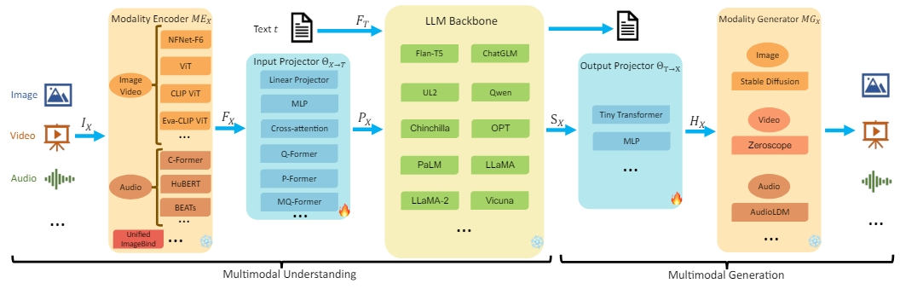|__MM-LLMs: Recent Advances in MultiModal Large Language Models__|__arxiv 2024__|[`Paper`](https://arxiv.org/pdf/2401.13601) [`Github`](https://mm-llms.github.io/)|
|41|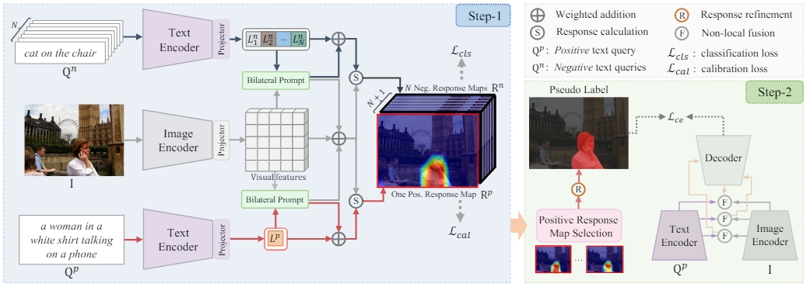|__Referring Image Segmentation Using Text Supervision__|__ICCV 2023__|[`Paper`](https://arxiv.org/pdf/2308.14575) [`Github`](https://github.com/fawnliu/TRIS)|
|40||__Shatter and Gather: Learning Referring Image Segmentation with Text Supervision__|__ICCV 2023__|[`Paper`](https://arxiv.org/abs/2308.15512) [`Github`](https://southflame.github.io/sag/)|
|39|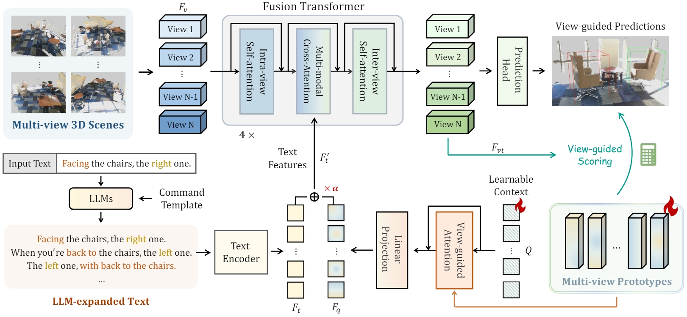|__ViewRefer: Grasp the Multi-view Knowledge for 3D Visual Grounding__|__ICCV 2023__|[`Paper`](https://arxiv.org/pdf/2303.16894) [`Github`](https://github.com/Ivan-Tang-3D/ViewRefer3D)|
|38|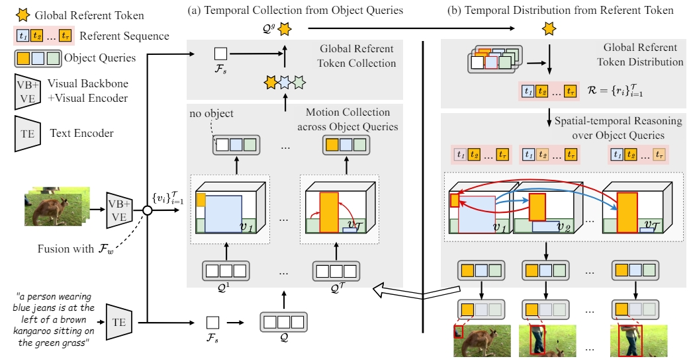|__Temporal Collection and Distribution for Referring Video Object Segmentation__|__ICCV 2023__|[`Paper`](https://openaccess.thecvf.com/content/ICCV2023/papers/Tang_Temporal_Collection_and_Distribution_for_Referring_Video_Object_Segmentation_ICCV_2023_paper.pdf) [`Github`](https://toneyaya.github.io/tempcd)|
|37|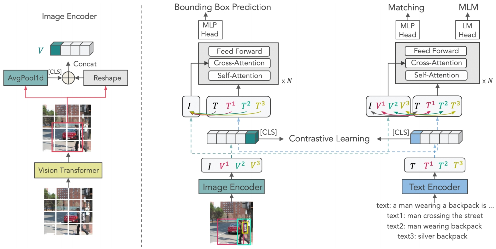|__Multi-Grained Vision Language Pre-Training: Aligning Texts with Visual Concepts__|__ICML 2022__|[`Paper`](https://arxiv.org/abs/2111.08276) [`Github`](https://github.com/zengyan-97/X-VLM)|
|36|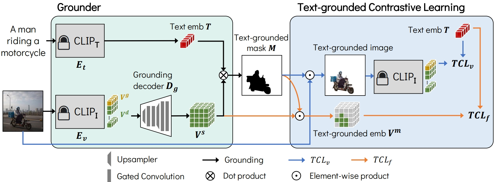|__Learning to Generate Text-grounded Mask for Open-world Semantic Segmentation from Only Image-Text Pairs__|__CVPR 2023__|[`Paper`](https://arxiv.org/abs/2212.00785) [`Github`](https://github.com/kakaobrain/tcl)|
|35|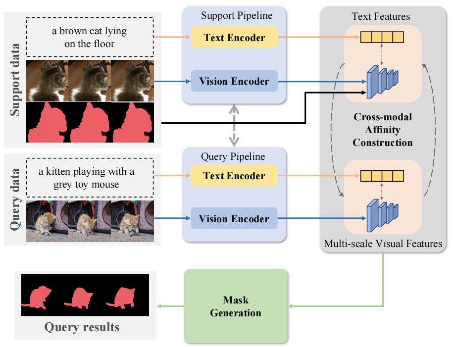|__Learning Cross-Modal Affinity for Referring Video Object Segmentation Targeting Limited Samples__|__ICCV 2023__|[`Paper`](https://arxiv.org/abs/2309.02041v1) [`Github`](https://github.com/hengliusky/Few_shot_RVOS)|
|34|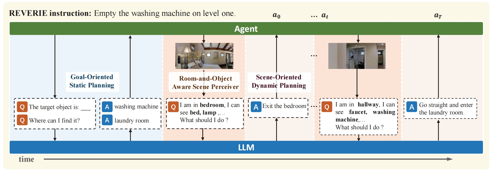|__March in Chat: Interactive Prompting for Remote Embodied Referring Expression__|__ICCV 2023__|[`Paper`](https://arxiv.org/pdf/2308.10141.pdf) [`Github`](https://github.com/YanyuanQiao/MiC)|
|33|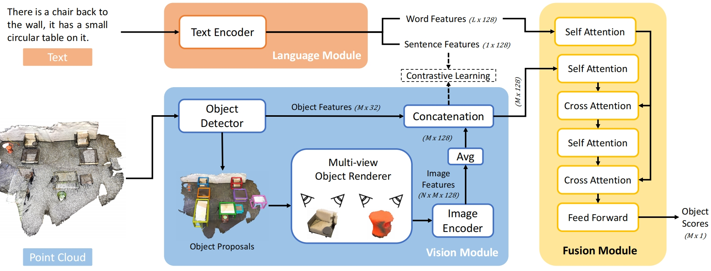|__Multi3DRefer: Grounding Text Description to Multiple 3D Objects__|__ICCV 2023__|[`Paper`](https://openaccess.thecvf.com/content/ICCV2023/papers/Zhang_Multi3DRefer_Grounding_Text_Description_to_Multiple_3D_Objects_ICCV_2023_paper.pdf) [`Github`](https://3dlg-hcvc.github.io/multi3drefer/#/)|
|32||__RefEgo: Referring Expression Comprehension Dataset from First-Person Perception of Ego4D__|__ICCV 2023__|[`Paper`](https://openaccess.thecvf.com/content/ICCV2023/papers/Kurita_RefEgo_Referring_Expression_Comprehension_Dataset_from_First-Person_Perception_of_Ego4D_ICCV_2023_paper.pdf) [`Github`](https://github.com/shuheikurita/RefEgo)|
|31|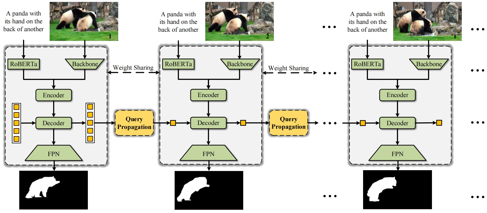|__OnlineRefer: A Simple Online Baseline for Referring Video Object Segmentation__|__ICCV 2023__|[`Paper`](https://openaccess.thecvf.com/content/ICCV2023/papers/Wu_OnlineRefer_A_Simple_Online_Baseline_for_Referring_Video_Object_Segmentation_ICCV_2023_paper.pdf) [`Github`](https://github.com/wudongming97/OnlineRefer)|
|30|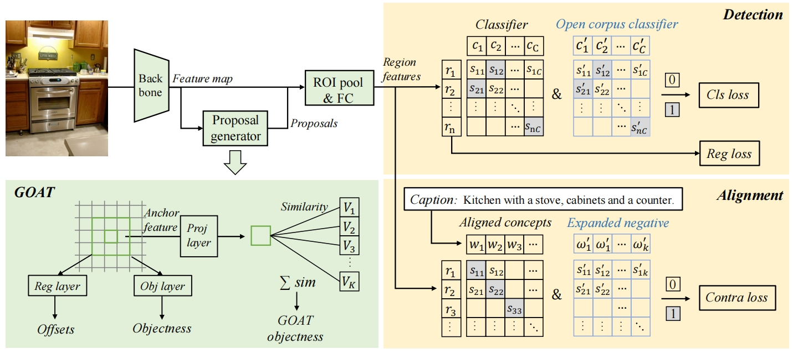|__Open-Vocabulary Object Detection With an Open Corpus__|__ICCV 2023__|[`Paper`](https://openaccess.thecvf.com/content/ICCV2023/papers/Wang_Open-Vocabulary_Object_Detection_With_an_Open_Corpus_ICCV_2023_paper.pdf)|
|29|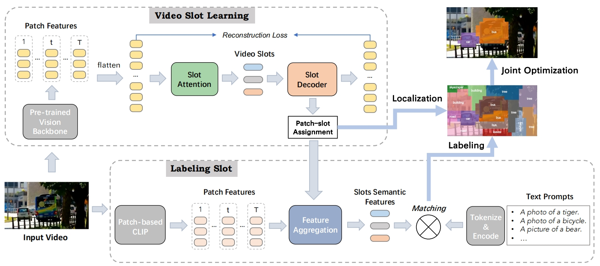|__Unsupervised Open-Vocabulary Object Localization in Videos__|__ICCV 2023__|[`Paper`](https://arxiv.org/abs/2309.09858)|
|28|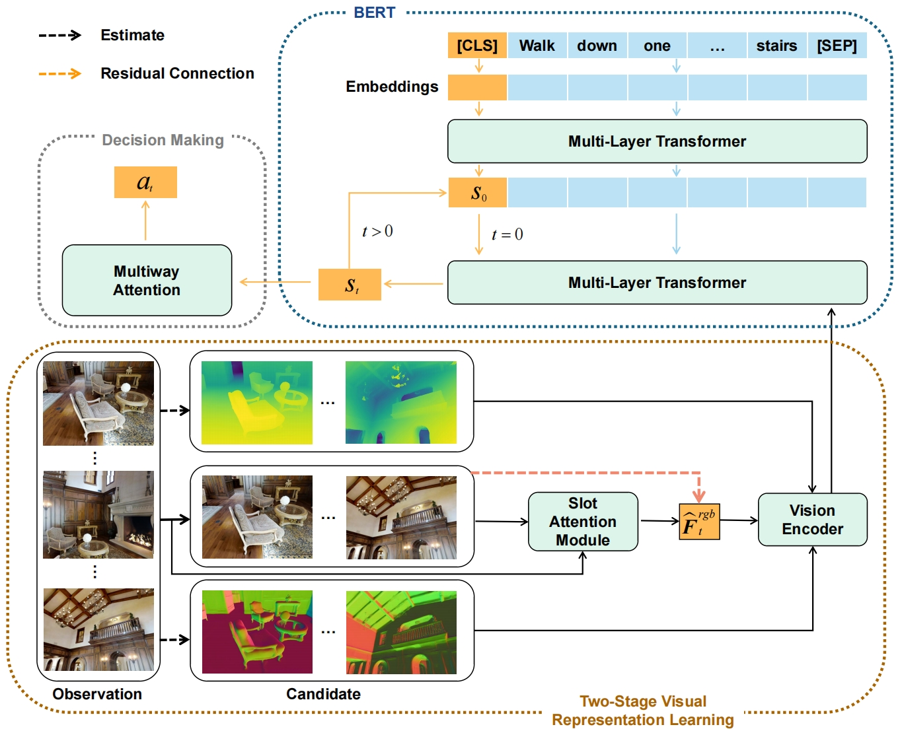|__GeoVLN: Learning Geometry-Enhanced Visual Representation with Slot Attention for Vision-and-Language Navigation__|__CVPR 2023__|[`Paper`](https://openaccess.thecvf.com/content/CVPR2023/papers/Huo_GeoVLN_Learning_Geometry-Enhanced_Visual_Representation_With_Slot_Attention_for_Vision-and-Language_CVPR_2023_paper.pdf)|
|27|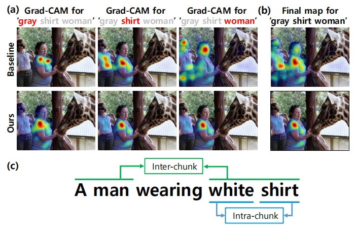|__Weakly Supervised Referring Image Segmentation with Intra-Chunk and Inter-Chunk Consistency__|__ICCV 2023__|[`Paper`](https://openaccess.thecvf.com/content/ICCV2023/papers/Lee_Weakly_Supervised_Referring_Image_Segmentation_with_Intra-Chunk_and_Inter-Chunk_Consistency_ICCV_2023_paper.pdf)|
|26|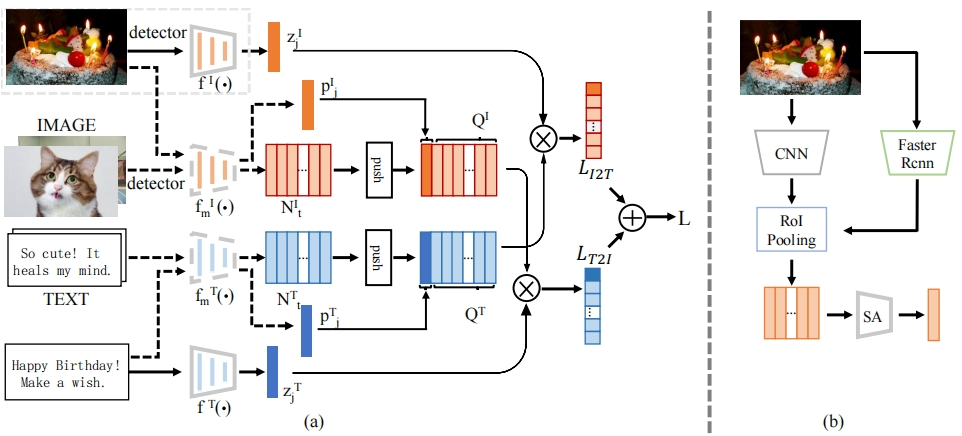|__WenLan: Bridging Vision and Language by Large-Scale Multi-Modal Pre-Training__|__ARXIV 2021__|[`Paper`](https://arxiv.org/abs/2103.06561) [`Github`](https://github.com/BAAI-WuDao/BriVL)|
|25|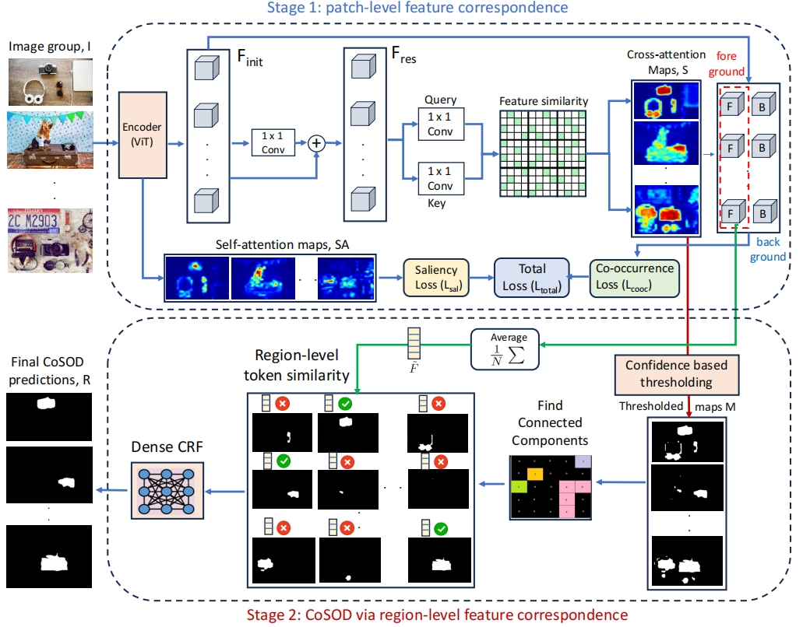|__Self-supervised co-salient object detection via feature correspondence at multiple scales__|__ARXIV 2024__|[`Paper`](https://arxiv.org/abs/2403.11107) [`Github`](https://github.com/sourachakra/SCoSPARC)|
|24|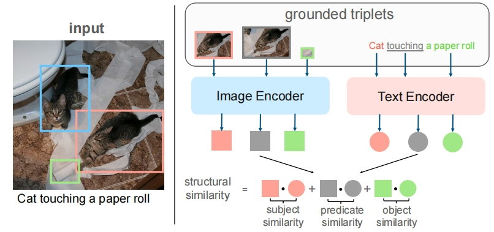|__Zero-shot Referring Expression Comprehension via Structural Similarity Between Images and Captions__|__CVPR 2024__|[`Paper`](https://arxiv.org/abs/2311.17048) [`Github`](https://github.com/Show-han/Zeroshot_REC)| 
|23|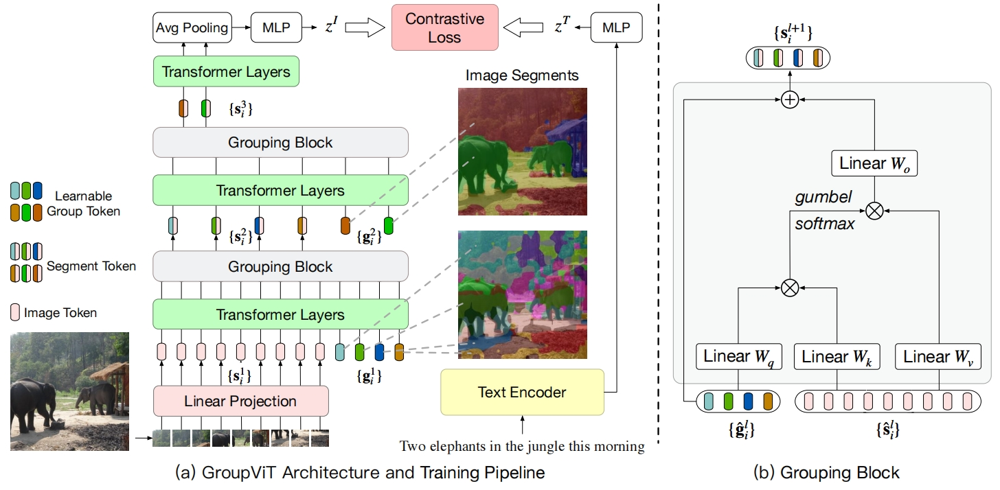|__GroupViT: Semantic Segmentation Emerges from Text Supervision__|__CVPR 2022__|[`Paper`](https://openaccess.thecvf.com/content/CVPR2022/papers/Xu_GroupViT_Semantic_Segmentation_Emerges_From_Text_Supervision_CVPR_2022_paper.pdf) [`Github`](https://github.com/NVlabs/GroupViT)|
|22|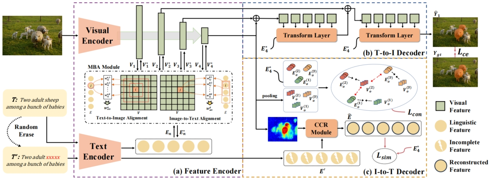|__Beyond One-to-One: Rethinking the Referring Image Segmentation__|__ICCV 2023__|[`Paper`](https://openaccess.thecvf.com/content/ICCV2023/papers/Hu_Beyond_One-to-One_Rethinking_the_Referring_Image_Segmentation_ICCV_2023_paper.pdf) [`Github`](https://github.com/toggle1995/RIS-DMMI)|
|21|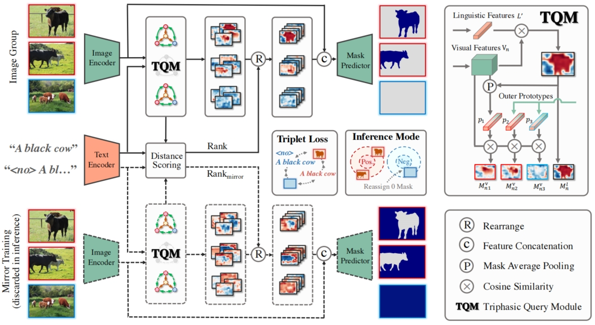|__Advancing Referring Expression Segmentation Beyond Single Image__|__ICCV 2023__|[`Paper`](https://openaccess.thecvf.com/content/ICCV2023/papers/Wu_Advancing_Referring_Expression_Segmentation_Beyond_Single_Image_ICCV_2023_paper.pdf) [`Github`](https://github.com/shikras/d-cube/tree/main?tab=readme-ov-file#download)|  
|20||__Learning Open-Vocabulary Semantic Segmentation Models From Natural Language Supervision__|__CVPR 2023__|[`Paper`](https://arxiv.org/abs/2301.09121) [`Github`](https://github.com/Jazzcharles/OVSegmentor/#learning-open-vocabulary-semantic-segmentation-models-from-natural-language-supervision)|
|19|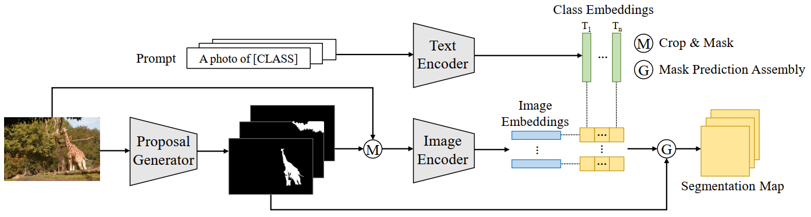|__A Simple Baseline for Open-Vocabulary Semantic Segmentation with Pre-trained Vision-language Model__|__ECCV 2022__|[`Paper`](https://arxiv.org/abs/2112.14757) [`Github`](https://github.com/MendelXu/zsseg.baseline)|
|18|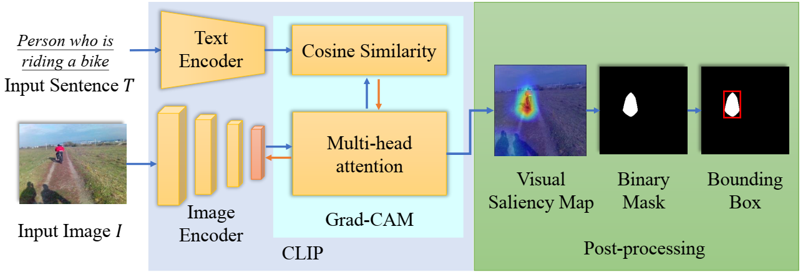|__CLIPCAM: A SIMPLE BASELINE FOR ZERO-SHOT TEXT-GUIDED OBJECT AND ACTION LOCALIZATION__|__ICASSP 2022__|[`Paper`](https://ieeexplore.ieee.org/document/9747841) [`Github`](https://github.com/aiiu-lab/CLIPCAM)| 
|17||__Zero-shot Referring Image Segmentation with Global-Local Context Features__|__CVPR 2023__|[`Paper`](https://openaccess.thecvf.com/content/CVPR2023/papers/Yu_Zero-Shot_Referring_Image_Segmentation_With_Global-Local_Context_Features_CVPR_2023_paper.pdf) [`Github`](https://github.com/Seonghoon-Yu/Zero-shot-RIS)|
|16||__Learning Pixel-level Semantic Affinity with Image-level Supervision for Weakly Supervised Semantic Segmentation__|__CVPR 2018__|[`Paper`](https://openaccess.thecvf.com/content_cvpr_2018/papers/Ahn_Learning_Pixel-Level_Semantic_CVPR_2018_paper.pdf) [`Github`](https://github.com/jiwoon-ahn/psa)|
|15||__Weakly Supervised Few-shot Object Segmentation using Co-Attention with Visual and Semantic Embeddings__|__IJCAI 2020__|[`Paper`](https://arxiv.org/abs/2001.09540)|
|14||__Unsupervised Vision-Language Parsing: Seamlessly Bridging Visual Scene Graphs with Language Structures via Dependency Relationships__|__CVPR 2022__|[`Paper`](https://openaccess.thecvf.com/content/CVPR2022/papers/Lou_Unsupervised_Vision-Language_Parsing_Seamlessly_Bridging_Visual_Scene_Graphs_With_Language_CVPR_2022_paper.pdf) [`Github`](https://github.com/bigai-research/VLGAE)|
|13|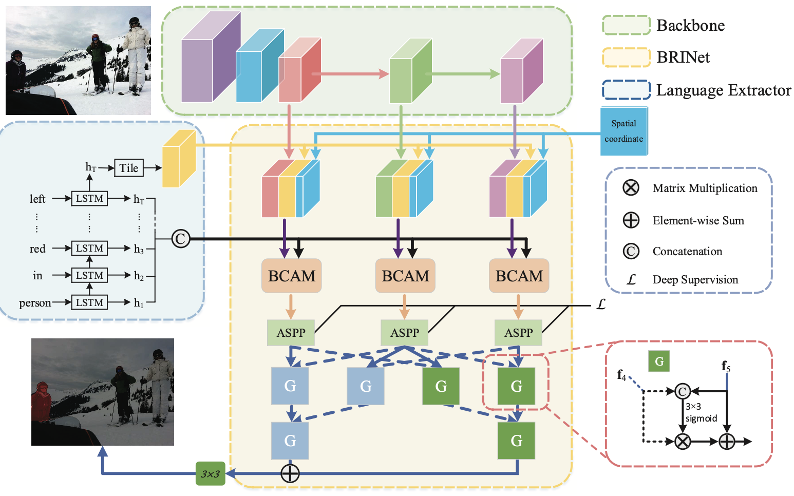|__Bi-directional Relationship Inferring Network for Referring Image Segmentation__|__CVPR 2020__|[`Paper`](https://openaccess.thecvf.com/content_CVPR_2020/papers/Hu_Bi-Directional_Relationship_Inferring_Network_for_Referring_Image_Segmentation_CVPR_2020_paper.pdf) [`Github`](https://github.com/fengguang94/CVPR2020-BRINet)|
|12||__Mucko: Multi-Layer Cross-Modal Knowledge Reasoning for Fact-based Visual Question Answering__|__IJCAI 2020__|[`Paper`](https://www.ijcai.org/proceedings/2020/0153.pdf) [`Github`](https://github.com/astro-zihao/mucko)|
|11|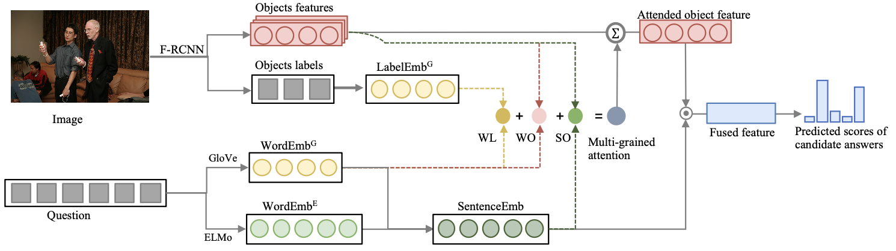|__Multi-grained Attention with Object-level Grounding for Visual Question Answering__|__ACL 2019__|[`Paper`](https://aclanthology.org/P19-1349.pdf)|
|10|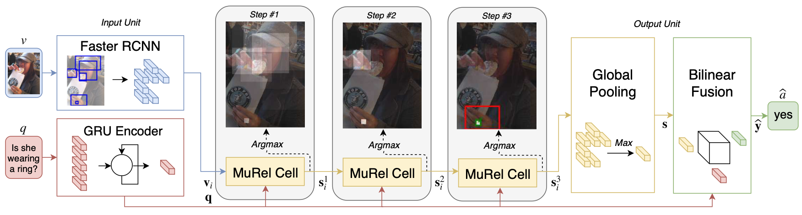|__MUREL: Multimodal Relational Reasoning for Visual Question Answering__|__CVPR 2019__|[`Paper`](https://openaccess.thecvf.com/content_CVPR_2019/papers/Cadene_MUREL_Multimodal_Relational_Reasoning_for_Visual_Question_Answering_CVPR_2019_paper.pdf) [`Github`](https://github.com/Cadene/murel.bootstrap.pytorch)|
|9||__Multi-Modal Graph Neural Network for Joint Reasoning on Vision and Scene Text__|__CVPR 2020__|[`Paper`](https://arxiv.org/abs/2003.13962) [`Github`](https://github.com/ricolike/mmgnn_textvqa)|
|8||__Weakly-supervised Salient Instance Detection__|__BMVC 2020__|[`Paper`](https://www.bmvc2020-conference.com/assets/papers/0430.pdf)|
|8||__Fine-grained Video-Text Retrieval with Hierarchical Graph Reasoning__|__CVPR 2020__|[`Paper`](https://openaccess.thecvf.com/content_CVPR_2020/papers/Chen_Fine-Grained_Video-Text_Retrieval_With_Hierarchical_Graph_Reasoning_CVPR_2020_paper.pdf) [`Github`](https://unclemedm.github.io/Refer-it-in-RGBD/)|
|7||__Refer-it-in-RGBD: A Bottom-up Approach for 3D Visual Grounding in RGBD Images__|__CVPR 2018__|[`Paper`](https://openaccess.thecvf.com/content/CVPR2021/papers/Liu_Refer-It-in-RGBD_A_Bottom-Up_Approach_for_3D_Visual_Grounding_in_RGBD_CVPR_2021_paper.pdf) [`Github`](https://unclemedm.github.io/Refer-it-in-RGBD/)|
|6||__Visual Grounding via Accumulated Attention__|__CVPR 2018__|[`Paper`](https://openaccess.thecvf.com/content_cvpr_2018/papers/Deng_Visual_Grounding_via_CVPR_2018_paper.pdf)|
|5||__RGB-D Salient Object Detection with Cross-Modality Modulation and Selection__|__ECCV 2020__|[`Paper`](https://www.ecva.net/papers/eccv_2020/papers_ECCV/papers/123530222.pdf) [`Github`](https://li-chongyi.github.io/Proj_ECCV20)|
|4||__Deep RGB-D Saliency Detection with Depth-Sensitive Attention and Automatic Multi-Modal Fusion__|__CVPR 2021__|[`Paper`](https://openaccess.thecvf.com/content/CVPR2021/papers/Sun_Deep_RGB-D_Saliency_Detection_With_Depth-Sensitive_Attention_and_Automatic_Multi-Modal_CVPR_2021_paper.pdf) [`Github`](https://github.com/sunpeng1996/DSA2F) |
|3||__Cross-Modal Self-Attention Network for Referring Image Segmentation__|__CVPR 2019__|[`Paper`](http://openaccess.thecvf.com/content_CVPR_2019/papers/Ye_Cross-Modal_Self-Attention_Network_for_Referring_Image_Segmentation_CVPR_2019_paper.pdf) [`Github`](https://github.com/NanWangAC/CMSA-Net) |
|2||__Cross-Modal Relationship Inference for Grounding Referring Expressions__|__CVPR 2019__|[`Paper`](http://openaccess.thecvf.com/content_CVPR_2019/papers/Yang_Cross-Modal_Relationship_Inference_for_Grounding_Referring_Expressions_CVPR_2019_paper.pdf) |
|1||__Language-Conditioned Graph Networks for Relational Reasoning__|__ICCV 2019__|[`Paper`](https://arxiv.org/pdf/1905.04405.pdf) [`Github`](https://github.com/ronghanghu/lcgn) |

