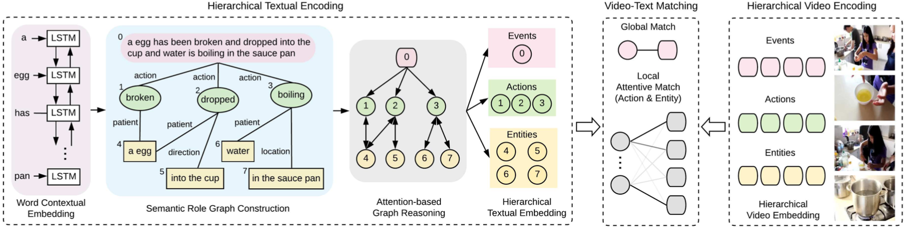

# Cross Model

|No.   |Figure   |Title   |Pub.  |Link|         
|:----|:-----:|:-----:|:-----:|:---:|
|19||__A Simple Baseline for Open-Vocabulary Semantic Segmentation with Pre-trained Vision-language Model__|__ECCV 2022__|[`Paper`](https://arxiv.org/abs/2112.14757) [`Github`](https://github.com/MendelXu/zsseg.baseline)|
|18||__CLIPCAM: A SIMPLE BASELINE FOR ZERO-SHOT TEXT-GUIDED OBJECT AND ACTION LOCALIZATION__|__ICASSP 2022__|[`Paper`](https://ieeexplore.ieee.org/document/9747841) [`Github`](https://github.com/aiiu-lab/CLIPCAM)| 
|17||__Zero-shot Referring Image Segmentation with Global-Local Context Features__|__CVPR 2023__|[`Paper`](https://openaccess.thecvf.com/content/CVPR2023/papers/Yu_Zero-Shot_Referring_Image_Segmentation_With_Global-Local_Context_Features_CVPR_2023_paper.pdf) [`Github`](https://github.com/Seonghoon-Yu/Zero-shot-RIS)|
|16||__Learning Pixel-level Semantic Affinity with Image-level Supervision for Weakly Supervised Semantic Segmentation__|__CVPR 2018__|[`Paper`](https://openaccess.thecvf.com/content_cvpr_2018/papers/Ahn_Learning_Pixel-Level_Semantic_CVPR_2018_paper.pdf) [`Github`](https://github.com/jiwoon-ahn/psa)|
|15||__Weakly Supervised Few-shot Object Segmentation using Co-Attention with Visual and Semantic Embeddings__|__IJCAI 2020__|[`Paper`](https://arxiv.org/abs/2001.09540)|
|14||__Unsupervised Vision-Language Parsing: Seamlessly Bridging Visual Scene Graphs with Language Structures via Dependency Relationships__|__CVPR 2022__|[`Paper`](https://openaccess.thecvf.com/content/CVPR2022/papers/Lou_Unsupervised_Vision-Language_Parsing_Seamlessly_Bridging_Visual_Scene_Graphs_With_Language_CVPR_2022_paper.pdf) [`Github`](https://github.com/bigai-research/VLGAE)|
|13||__Bi-directional Relationship Inferring Network for Referring Image Segmentation__|__CVPR 2020__|[`Paper`](https://openaccess.thecvf.com/content_CVPR_2020/papers/Hu_Bi-Directional_Relationship_Inferring_Network_for_Referring_Image_Segmentation_CVPR_2020_paper.pdf) [`Github`](https://github.com/fengguang94/CVPR2020-BRINet)|
|12||__Mucko: Multi-Layer Cross-Modal Knowledge Reasoning for Fact-based Visual Question Answering__|__IJCAI 2020__|[`Paper`](https://www.ijcai.org/proceedings/2020/0153.pdf) [`Github`](https://github.com/astro-zihao/mucko)|
|11||__Multi-grained Attention with Object-level Grounding for Visual Question Answering__|__ACL 2019__|[`Paper`](https://aclanthology.org/P19-1349.pdf)|
|10||__MUREL: Multimodal Relational Reasoning for Visual Question Answering__|__CVPR 2019__|[`Paper`](https://openaccess.thecvf.com/content_CVPR_2019/papers/Cadene_MUREL_Multimodal_Relational_Reasoning_for_Visual_Question_Answering_CVPR_2019_paper.pdf) [`Github`](https://github.com/Cadene/murel.bootstrap.pytorch)|
|9||__Multi-Modal Graph Neural Network for Joint Reasoning on Vision and Scene Text__|__CVPR 2020__|[`Paper`](https://arxiv.org/abs/2003.13962) [`Github`](https://github.com/ricolike/mmgnn_textvqa)|
|8||__Weakly-supervised Salient Instance Detection__|__BMVC 2020__|[`Paper`](https://www.bmvc2020-conference.com/assets/papers/0430.pdf)|
|8||__Fine-grained Video-Text Retrieval with Hierarchical Graph Reasoning__|__CVPR 2020__|[`Paper`](https://openaccess.thecvf.com/content_CVPR_2020/papers/Chen_Fine-Grained_Video-Text_Retrieval_With_Hierarchical_Graph_Reasoning_CVPR_2020_paper.pdf) [`Github`](https://unclemedm.github.io/Refer-it-in-RGBD/)|
|7||__Refer-it-in-RGBD: A Bottom-up Approach for 3D Visual Grounding in RGBD Images__|__CVPR 2018__|[`Paper`](https://openaccess.thecvf.com/content/CVPR2021/papers/Liu_Refer-It-in-RGBD_A_Bottom-Up_Approach_for_3D_Visual_Grounding_in_RGBD_CVPR_2021_paper.pdf) [`Github`](https://unclemedm.github.io/Refer-it-in-RGBD/)|
|6||__Visual Grounding via Accumulated Attention__|__CVPR 2018__|[`Paper`](https://openaccess.thecvf.com/content_cvpr_2018/papers/Deng_Visual_Grounding_via_CVPR_2018_paper.pdf)|
|5||__RGB-D Salient Object Detection with Cross-Modality Modulation and Selection__|__ECCV 2020__|[`Paper`](https://www.ecva.net/papers/eccv_2020/papers_ECCV/papers/123530222.pdf) [`Github`](https://li-chongyi.github.io/Proj_ECCV20)|
|4||__Deep RGB-D Saliency Detection with Depth-Sensitive Attention and Automatic Multi-Modal Fusion__|__CVPR 2021__|[`Paper`](https://openaccess.thecvf.com/content/CVPR2021/papers/Sun_Deep_RGB-D_Saliency_Detection_With_Depth-Sensitive_Attention_and_Automatic_Multi-Modal_CVPR_2021_paper.pdf) [`Github`](https://github.com/sunpeng1996/DSA2F) |
|3||__Cross-Modal Self-Attention Network for Referring Image Segmentation__|__CVPR 2019__|[`Paper`](http://openaccess.thecvf.com/content_CVPR_2019/papers/Ye_Cross-Modal_Self-Attention_Network_for_Referring_Image_Segmentation_CVPR_2019_paper.pdf) [`Github`](https://github.com/NanWangAC/CMSA-Net) |
|2||__Cross-Modal Relationship Inference for Grounding Referring Expressions__|__CVPR 2019__|[`Paper`](http://openaccess.thecvf.com/content_CVPR_2019/papers/Yang_Cross-Modal_Relationship_Inference_for_Grounding_Referring_Expressions_CVPR_2019_paper.pdf) |
|1||__Language-Conditioned Graph Networks for Relational Reasoning__|__ICCV 2019__|[`Paper`](https://arxiv.org/pdf/1905.04405.pdf) [`Github`](https://github.com/ronghanghu/lcgn) |

