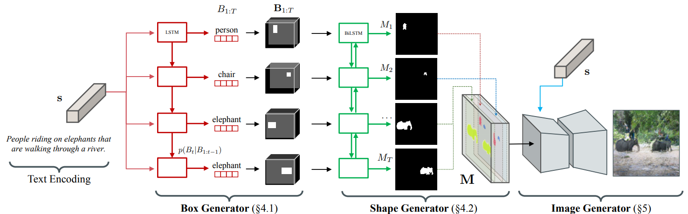
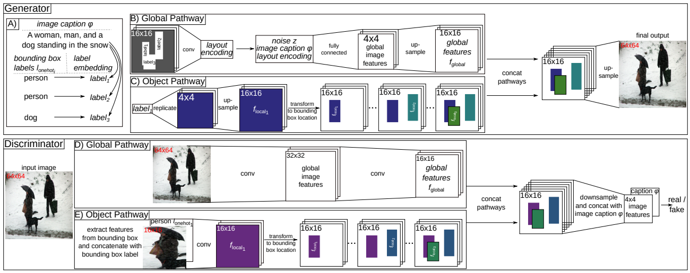
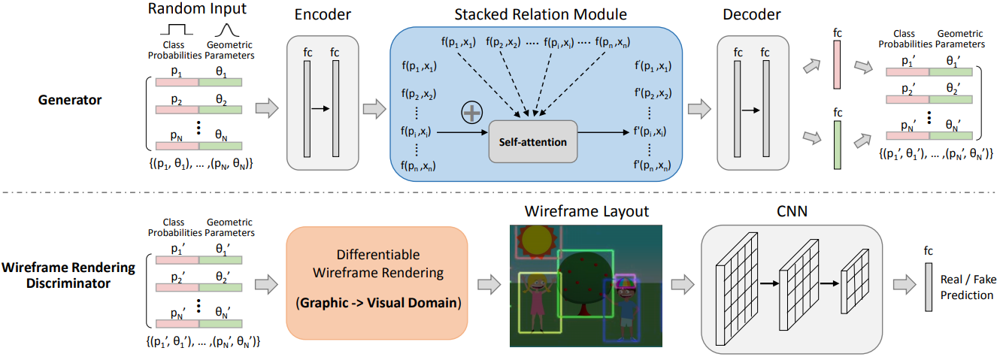
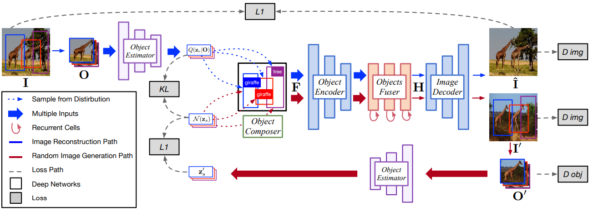
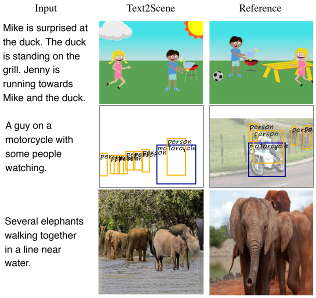
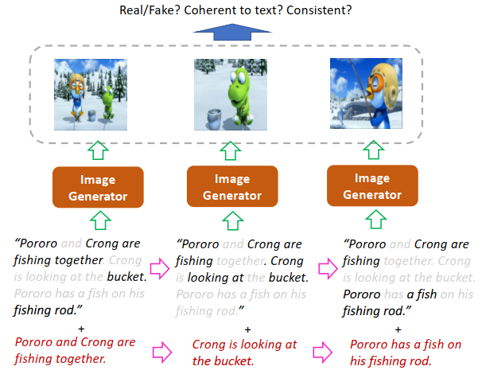
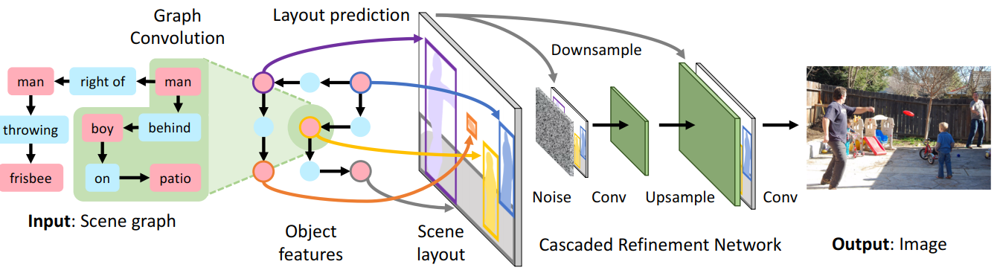
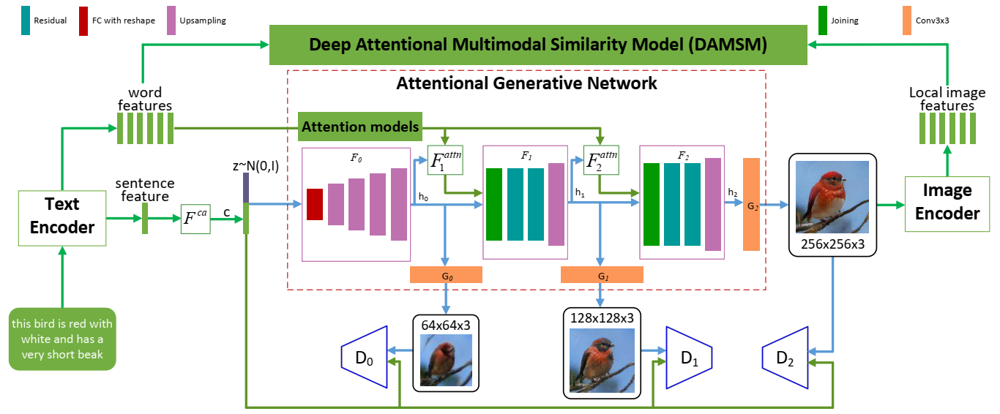
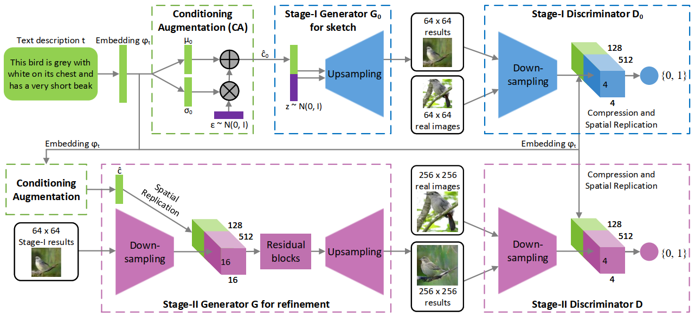

# Knowledge Graph

|No.   |Figure   |Title   |Pub.  |Link|
|-----|:-----:|:-----:|:-----:|:---:|
|10 | | __Inferring Semantic Layout for Hierarchical Text-to-Image Synthesis__ | __CVPR 2018__ |       [`Paper`](https://arxiv.org/pdf/1801.05091.pdf)        |
| 9    |                      | __Generating Multiple Objects at Spatially Distinct Locations__ | __ICLR 2019__ | [`Paper`](https://github.com/tohinz/multiple-objects-gan) [`Github`](https://github.com/tohinz/multiple-objects-gan) |
| 8    |          | __LayoutGAN: Generating Graphic Layouts with Wireframe Discriminators__ | __ICLR 2019__ | [`Paper`](https://arxiv.org/abs/1901.06767) [`Github`](https://github.com/billzhonggz/LayoutGAN) |
| 7    |          |               __Image Generation from Layout__               | __CVPR 2019__ | [`Paper`](https://arxiv.org/pdf/1811.11389.pdf) [`Github`](https://github.com/zhaobozb/layout2im) |
| 6    |        | __Text2Scene: Generating Compositional Scenes from Textual Descriptions__ | __CVPR 2019__ | [`Paper`](http://openaccess.thecvf.com/content_CVPR_2019/papers/Tan_Text2Scene_Generating_Compositional_Scenes_From_Textual_Descriptions_CVPR_2019_paper.pdf) [`Github`](https://github.com/uvavision/Text2Scene) |
| 5    |            | __StoryGAN: A Sequential Conditional GAN for Story Visualization__ | __CVPR 2019__ | [`Paper`](https://arxiv.org/abs/1812.02784) [`Github`](https://github.com/yitong91/StoryGAN) |
|4||__Image Generation from Scene Graphs__|__CVPR 2018__|[`Paper`](https://arxiv.org/abs/1804.01622) [`Github`](https://github.com/google/sg2im)  |
|3||__AttnGAN: Fine-Grained Text to Image Generation with Attentional Generative Adversarial Networks__|__CVPR 2018__|[`Paper`](https://arxiv.org/abs/1711.10485) [`Github`](https://github.com/taoxugit/AttnGAN) |
|2||__StackGAN: Text to Photo-realistic Image Synthesis with Stacked Generative Adversarial Networks__|__CVPR 2017__|[`Paper`](https://arxiv.org/pdf/1612.03242v1.pdf) [`Github`](https://github.com/hanzhanggit/StackGAN-v2) |
|1||__Generative Adversarial Text to Image Synthesis__|__ICML 2016__|[`Paper`](https://arxiv.org/abs/1605.05396) [`Github`](https://github.com/reedscot/icml2016) [`Github1`](https://github.com/aelnouby/Text-to-Image-Synthesis) |

