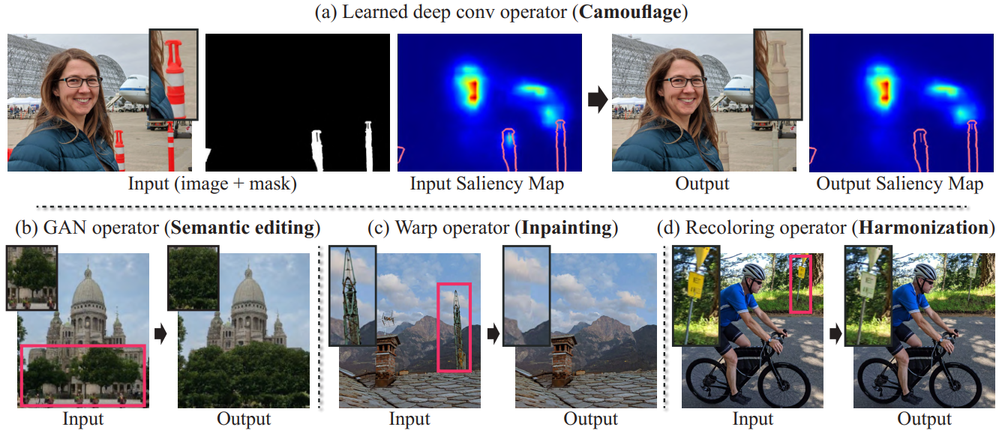
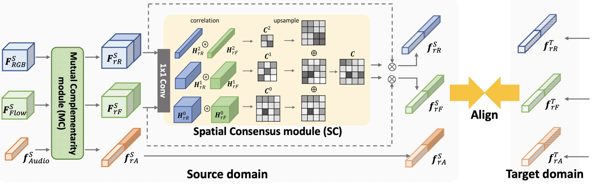
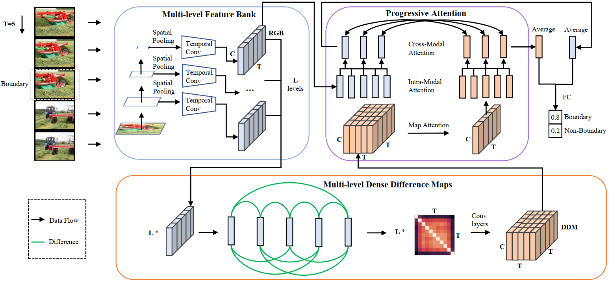
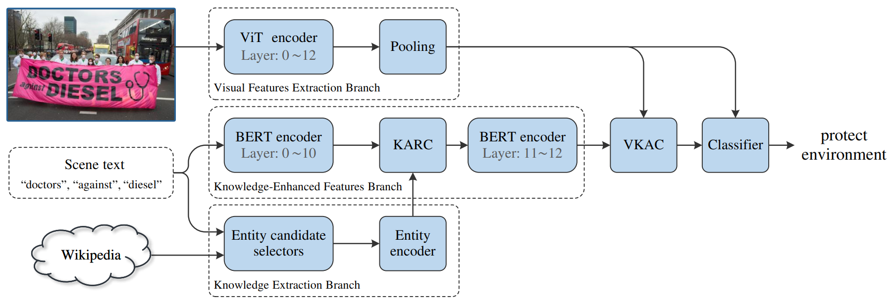
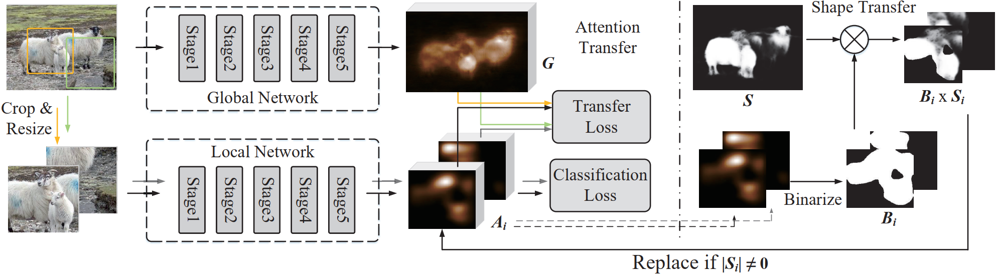
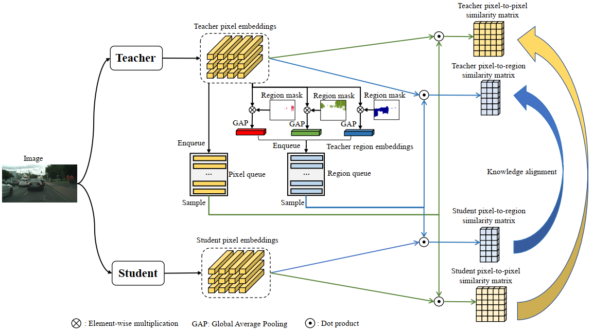
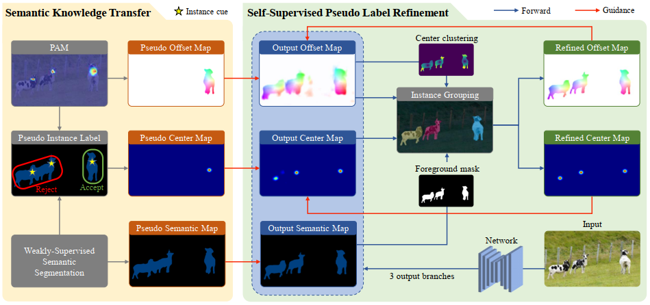
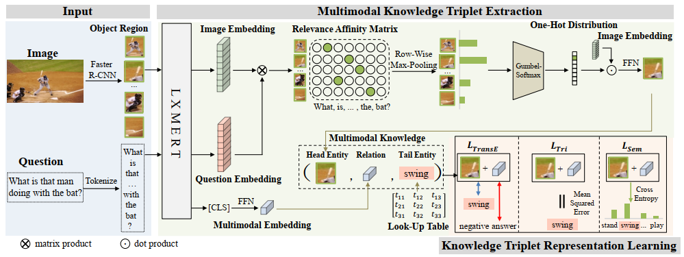

# Knowledge

|No.   |Figure   |Title   |Pub.  |Link|
|-----|:-----:|:-----:|:-----:|:---:|
|8||__Deep Saliency Prior for Reducing Visual Distraction__|__CVPR 2022__|[`Webpage`](https://deep-saliency-prior.github.io/) |
|7||__Interact before Align: Leveraging Cross-Modal Knowledge for Domain Adaptive Action Recognition__|__CVPR 2022__|[`Paper`](https://openaccess.thecvf.com/content/CVPR2022/papers/Yang_Interact_Before_Align_Leveraging_Cross-Modal_Knowledge_for_Domain_Adaptive_Action_CVPR_2022_paper.pdf) |
|6||__Progressive Attention on Multi-Level Dense Difference Maps for Generic Event Boundary Detection__|__CVPR 2022__|[`Paper`](https://openaccess.thecvf.com/content/CVPR2022/papers/Tang_Progressive_Attention_on_Multi-Level_Dense_Difference_Maps_for_Generic_Event_CVPR_2022_paper.pdf) [`Github`](https://github.com/MCG-NJU/DDM) |
|5||__Knowledge Mining with Scene Text for Fine-Grained Recognition__|__CVPR 2022__|[`Paper`](https://openaccess.thecvf.com/content/CVPR2022/papers/Wang_Knowledge_Mining_With_Scene_Text_for_Fine-Grained_Recognition_CVPR_2022_paper.pdf) [`Github`](https://github.com/lanfeng4659/KnowledgeMiningWithSceneText) |
|4||__L2G: A Simple Local-to-Global Knowledge Transfer Framework for Weakly Supervised Semantic Segmentation__|__CVPR 2022__|[`Paper`](https://arxiv.org/abs/2204.03206) [`Github`](https://github.com/PengtaoJiang/L2G) |
|3||__Cross-Image Relational Knowledge Distillation for Semantic Segmentation__|__CVPR 2022__|[`Paper`](https://arxiv.org/abs/2204.06986) [`Github`](https://github.com/winycg/cirkd) |
|2||__Beyond Semantic to Instance Segmentation: Weakly-Supervised Instance Segmentation via Semantic Knowledge Transfer and Self-Refinement__|__CVPR 2022__|[`Paper`](https://arxiv.org/abs/2109.09477)  [`Github`](https://github.com/clovaai/BESTIE) |
|1||__MuKEA: Multimodal Knowledge Extraction and Accumulation for Knowledge-based Visual Question Answering__|__CVPR 2022__|[`Paper`](https://openaccess.thecvf.com/content/CVPR2022/papers/Ding_MuKEA_Multimodal_Knowledge_Extraction_and_Accumulation_for_Knowledge-Based_Visual_Question_CVPR_2022_paper.pdf) [`Github`](https://github.com/andersonstra/mukea) |

