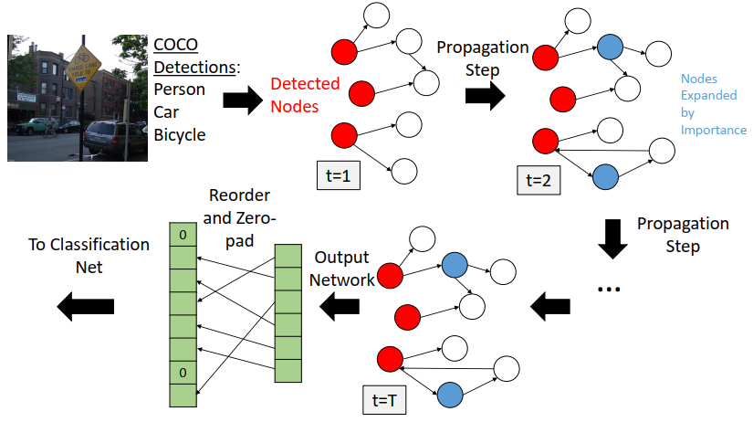
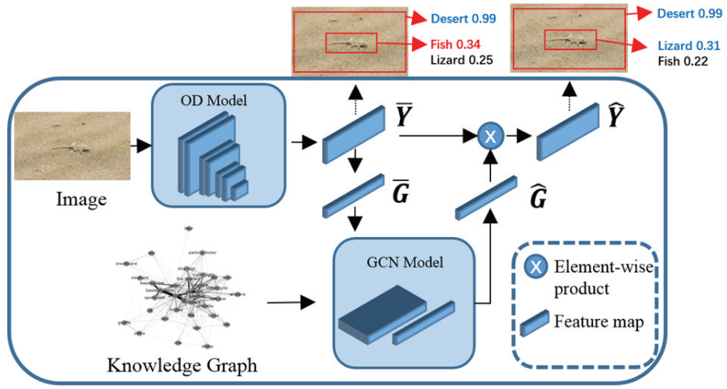

# Knowledge Graph

|No.   |Figure   |Title   |Pub.  |Links|
|-----|:-----:|:-----:|:-----:|:---:|
|3 | |__Zero-shot Recognition via Semantic Embeddings and Knowledge Graphs__ |CVPR 2018 |[`Paper`](https://arxiv.org/pdf/1803.08035.pdf)  [`Github`](https://github.com/JudyYe/zero-shot-gcn)|
|2||__The More You Know: Using Knowledge Graphs for Image Classification__|__CVPR 2017__|[`Paper`](http://openaccess.thecvf.com/content_cvpr_2017/papers/Marino_The_More_You_CVPR_2017_paper.pdf)  |
|1||__OD-GCN: OBJECT DETECTION BOOSTED BY KNOWLEDGE GCN__|__arXiv 2019__|[`Paper`](https://arxiv.org/abs/1908.04385)  |
