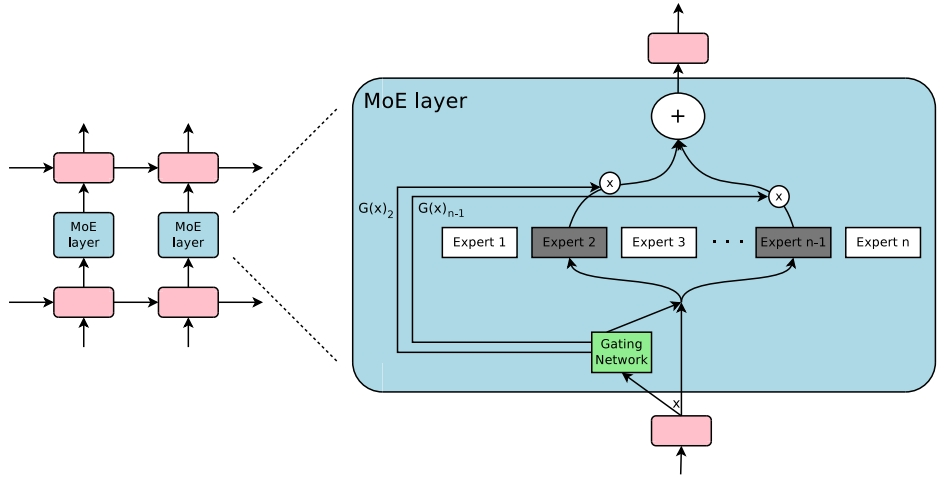
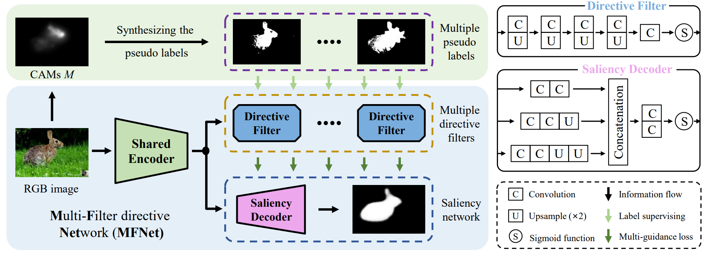

# Other topics

|No.   |Figure   |Title   |Pub.  |Links|
|-----|:-----:|:-----:|:-----:|:---:|
|23||__OUTRAGEOUSLY LARGE NEURAL NETWORKS: THE SPARSELY-GATED MIXTURE-OF-EXPERTS LAYER__|__ICLR 2017__|[`Paper`](https://arxiv.org/pdf/1701.06538) [`Github`](https://github.com/davidmrau/mixture-of-experts)|
|22||__Open-World Object Manipulation using Pre-Trained Vision-Language Models__|__CORL 2023__|[`Paper`](https://arxiv.org/abs/2303.00905) [`Github`](https://robot-moo.github.io/)|
|21||__Structure-Consistent Weakly Supervised Salient Object Detection with Local Saliency Coherence__|__AAAI 2021__|[`Paper`](https://cdn.aaai.org/ojs/16434/16434-13-19928-1-2-20210518.pdf) [`Github`](https://github.com/siyueyu/SCWSSOD)|
|20||__MSG-Transformer: Exchanging Local Spatial Information by Manipulating Messenger Tokens__|__CVPR 2022__|[`Paper`](https://openaccess.thecvf.com/content/CVPR2022/papers/Fang_MSG-Transformer_Exchanging_Local_Spatial_Information_by_Manipulating_Messenger_Tokens_CVPR_2022_paper.pdf) [`Github`](https://github.com/hustvl/MSG-Transformer)|
|19||__Deep Gradient Learning for Efficient Camouflaged Object Detection__|__MIR 2023__|[`Paper`](https://arxiv.org/abs/2205.12853) [`Github`](https://github.com/GewelsJI/DGNet)|
|18||__DETR: End-to-End Object Detection with Transformers__|__ECCV 2020__|[`Paper`](https://www.ecva.net/papers/eccv_2020/papers_ECCV/papers/123460205.pdf) [`Github`](https://github.com/facebookresearch/detr)|
|17||__DETR3D: 3D Object Detection from Multi-view Images via 3D-to-2D Queries__|__CORL 2021__|[`Paper`](https://arxiv.org/abs/2110.06922) [`Github`](https://github.com/WangYueFt/detr3d)|
|16||__Multimodal Object Detection by Channel Switching and Spatial Attention__|__CVPR 2023__|[`Paper`](https://openaccess.thecvf.com/content/CVPR2023W/PBVS/papers/Cao_Multimodal_Object_Detection_by_Channel_Switching_and_Spatial_Attention_CVPRW_2023_paper.pdf)|
|15||__Guided Slot Attention for Unsupervised Video Object Segmentation__|__CVPR 2024__|[`Paper`](https://arxiv.org/abs/2303.08314) [`Github`](https://github.com/Hydragon516/GSANet)|
|14||__Structure-Consistent Weakly Supervised Salient Object Detection with Local Saliency Coherence__|__AAAI 2021__|[`Paper`](https://cdn.aaai.org/ojs/16434/16434-13-19928-1-2-20210518.pdf) [`Github`](http://github.com/siyueyu/SCWSSOD)|
|13||__Correlation-aware Coarse-to-fine MLPs for Deformable Medical Image Registration__|__CVPR 2024__|[`Paper`](https://openaccess.thecvf.com/content/CVPR2024/papers/Meng_Correlation-aware_Coarse-to-fine_MLPs_for_Deformable_Medical_Image_Registration_CVPR_2024_paper.pdf) [`Github`](https://github.com/MungoMeng/Registration-CorrMLP)|
|12||__Neural Clustering based Visual Representation Learning__|__CVPR 2024__|[`Paper`](https://openaccess.thecvf.com/content/CVPR2024/papers/Chen_Neural_Clustering_based_Visual_Representation_Learning_CVPR_2024_paper.pdf) [`Github`](https://github.com/guikunchen/FEC/)|
|11||__ViP-CNN: Visual Phrase Guided Convolutional Neural Network__|__CVPR 2017__|[`Paper`](https://openaccess.thecvf.com/content_cvpr_2017/papers/Li_ViP-CNN_Visual_Phrase_CVPR_2017_paper.pdf)|
|10||__A Comprehensive Survey of Scene Graphs: Generation and Application__|__TPAMI 2µ023__|[`Paper`](https://arxiv.org/pdf/2104.01111.pdf)|
|9||__Zoom-Net: Mining Deep Feature Interactions for Visual Relationship Recognition__|__ECCV 2018__|[`Paper`](https://openaccess.thecvf.com/content_ECCV_2018/papers/Guojun_Yin_Zoom-Net_Mining_Deep_ECCV_2018_paper.pdf)|
|8||__SegDiff: Image Segmentation with Diffusion Probabilistic Models__|__arxiv 2022__|[`Paper`](https://arxiv.org/pdf/2112.00390.pdf)|
|7||__Anchor Diffusion for Unsupervised Video Object Segmentation__|__ICCV 2019__|[`Paper`](https://openaccess.thecvf.com/content_ICCV_2019/papers/Yang_Anchor_Diffusion_for_Unsupervised_Video_Object_Segmentation_ICCV_2019_paper.pdf) [`Github`](https://github.com/yz93/anchor-diff-VOS)|
|6||__MFNet: Multi-filter Directive Network for Weakly Supervised Salient Object Detection__|__ICCV 2021__|[`Paper`](https://openaccess.thecvf.com/content/ICCV2021/papers/Piao_MFNet_Multi-Filter_Directive_Network_for_Weakly_Supervised_Salient_Object_Detection_ICCV_2021_paper.pdf) [`Github`](https://github.com/OIPLab-DUT/MFNet)|
|5||__Visual Attention Methods in Deep Learning: An In-Depth Survey__|__arxiv 2022__|[`Paper`](https://arxiv.org/abs/2204.07756)|
|4||__Modular Interactive Video Object Segmentation: Interaction-to-Mask, Propagation and Difference-Aware Fusion__|__CVPR 2021__|[`Paper`](https://openaccess.thecvf.com/content/CVPR2021/papers/Cheng_Modular_Interactive_Video_Object_Segmentation_Interaction-to-Mask_Propagation_and_Difference-Aware_Fusion_CVPR_2021_paper.pdf) [`Github`](https://github.com/hkchengrex/MiVOS)|
|3||__Weakly Supervised Few-shot Object Segmentation using Co-Attention with Visual and Semantic Embeddings__|__IJCAI 2020__|[`Paper`](https://arxiv.org/abs/2001.09540)|
|2||__Rethinking Self-supervised Correspondence Learning: A Video Frame-level Similarity Perspective__|__ICCV 2021__|[`Paper`](https://openaccess.thecvf.com/content/ICCV2021/papers/Xu_Rethinking_Self-Supervised_Correspondence_Learning_A_Video_Frame-Level_Similarity_Perspective_ICCV_2021_paper.pdf) [`Project`](https://jerryxu.net/VFS/)|
|1||__Video Object Segmentation using Space-Time Memory Networks__|__ICCV 2019__|[`Paper`](https://openaccess.thecvf.com/content_ICCV_2019/papers/Oh_Video_Object_Segmentation_Using_Space-Time_Memory_Networks_ICCV_2019_paper.pdf) [`Github`](https://github.com/seoungwugoh/STM)|

