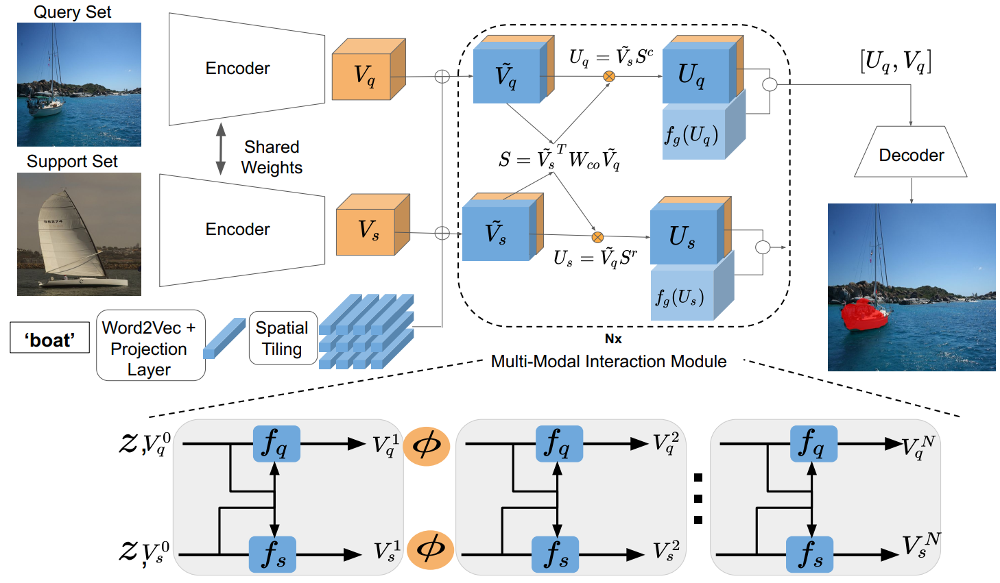

# Knowledge Graph

|No.   |Figure   |Title   |Pub.  |Links|
|-----|:-----:|:-----:|:-----:|:---:|
|4||__Modular Interactive Video Object Segmentation: Interaction-to-Mask, Propagation and Difference-Aware Fusion__|__CVPR 2021__|[`Paper`](https://openaccess.thecvf.com/content/CVPR2021/papers/Cheng_Modular_Interactive_Video_Object_Segmentation_Interaction-to-Mask_Propagation_and_Difference-Aware_Fusion_CVPR_2021_paper.pdf) [`Github`](https://github.com/hkchengrex/MiVOS)|
|3||__Weakly Supervised Few-shot Object Segmentation using Co-Attention with Visual and Semantic Embeddings__|__IJCAI 2020__|[`Paper`](https://arxiv.org/abs/2001.09540)|
|2||__Rethinking Self-supervised Correspondence Learning: A Video Frame-level Similarity Perspective__|__ICCV 2021__|[`Paper`](https://openaccess.thecvf.com/content/ICCV2021/papers/Xu_Rethinking_Self-Supervised_Correspondence_Learning_A_Video_Frame-Level_Similarity_Perspective_ICCV_2021_paper.pdf) [`Project`](https://jerryxu.net/VFS/)|
|1||__Video Object Segmentation using Space-Time Memory Networks__|__ICCV 2019__|[`Paper`](https://openaccess.thecvf.com/content_ICCV_2019/papers/Oh_Video_Object_Segmentation_Using_Space-Time_Memory_Networks_ICCV_2019_paper.pdf) [`Github`](https://github.com/seoungwugoh/STM)|

