# Remote Sensing

|No.   |Figure   |Title   |Pub.  |Links|
|-----|:-----:|:-----:|:-----:|:---:|
|11|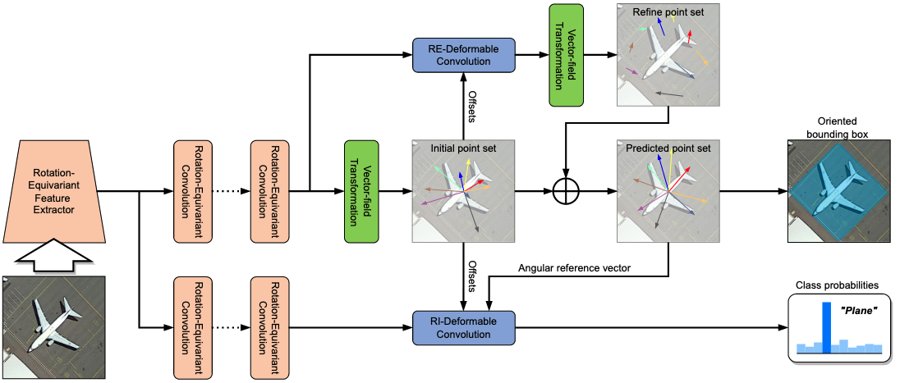|__FRED: Towards a Full Rotation-Equivariance in Aerial Image Object Detection__|__AAAI 2024__|[`Paper`](https://arxiv.org/pdf/2401.06159)| 
|10|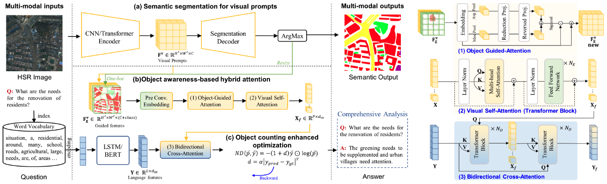|__EarthVQA: Towards Queryable Earth via Relational Reasoning-Based Remote Sensing Visual Question Answering__|__AAAI 2024__|[`Paper`](https://arxiv.org/pdf/2312.12222) [`Github`](https://Junjue-Wang.github.io/homepage/EarthVQA)| 
|9|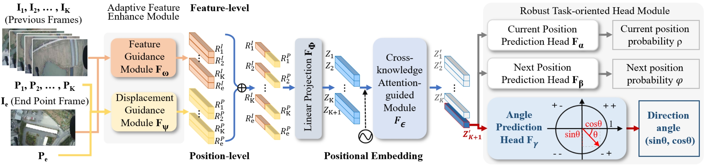|__Angle Robustness Unmanned Aerial Vehicle Navigation in GNSS-Denied Scenarios__|__AAAI 2024__|[`Paper`](https://arxiv.org/pdf/2402.02405) [`Github`](https://github.com/Katherine121/AngleRobust)| 
|8|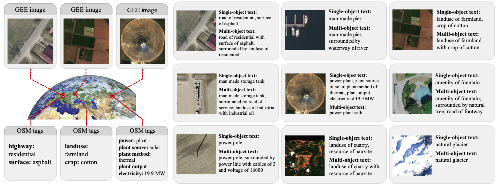|__SkyScript: A Large and Semantically Diverse Vision-Language Dataset for Remote Sensing__|__AAAI 2024__|[`Paper`](https://arxiv.org/pdf/2312.12856) [`Github`](https://github.com/wangzhecheng/SkyScript)| 
|7|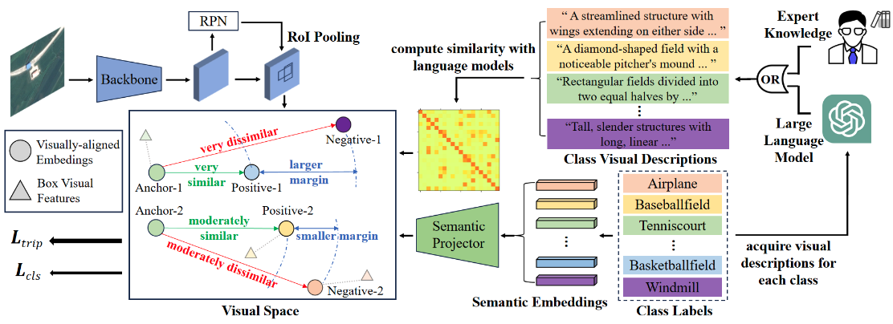|__Zero-Shot Aerial Object Detection with Visual Description Regularization__|__AAAI 2024__|[`Paper`](https://arxiv.org/pdf/2402.18233) [`Github`](https://github.com/zq-zang/DescReg)| 
|6|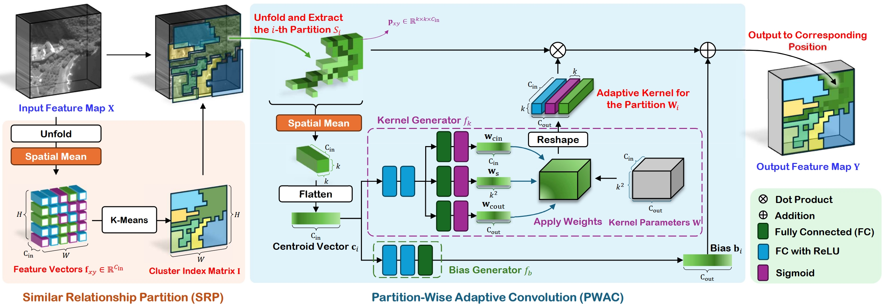|__Content-Adaptive Non-Local Convolution for Remote Sensing Pansharpening__|__CVPR 2024__|[`Paper`](https://openaccess.thecvf.com/content/CVPR2024/papers/Duan_Content-Adaptive_Non-Local_Convolution_for_Remote_Sensing_Pansharpening_CVPR_2024_paper.pdf) [`Github`](https://github.com/duanyll/CANConv)|
|5|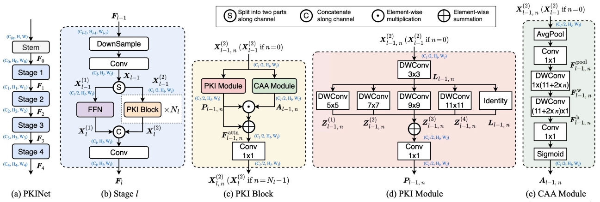|__Poly Kernel Inception Network for Remote Sensing Detection__|__CVPR 2024__|[`Paper`](https://openaccess.thecvf.com/content/CVPR2024/papers/Cai_Poly_Kernel_Inception_Network_for_Remote_Sensing_Detection_CVPR_2024_paper.pdf) [`Github`](https://github.com/NUST-Machine-Intelligence-Laboratory/PKINet)|
|4|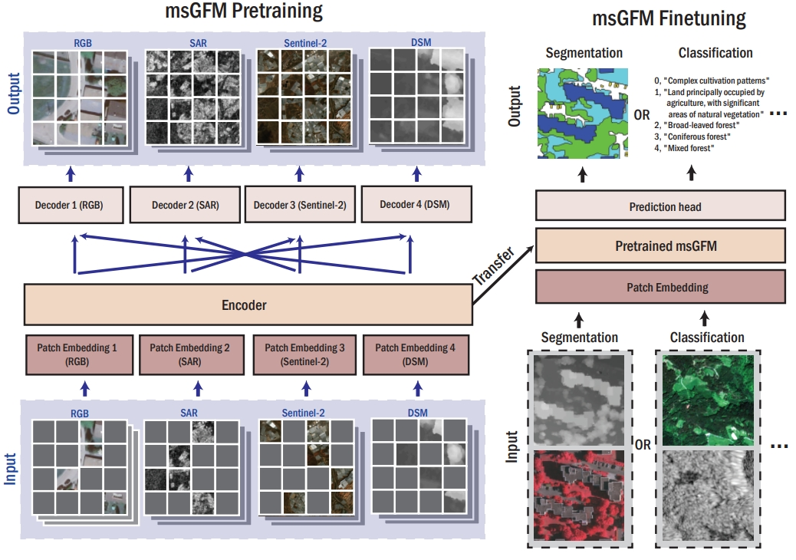|__Bridging Remote Sensors with Multisensor Geospatial Foundation Models__|__CVPR 2024__|[`Paper`](https://openaccess.thecvf.com/content/CVPR2024/papers/Han_Bridging_Remote_Sensors_with_Multisensor_Geospatial_Foundation_Models_CVPR_2024_paper.pdf) [`Github`](https://github.com/boranhan/Geospatial_Foundation_Models)|
|3|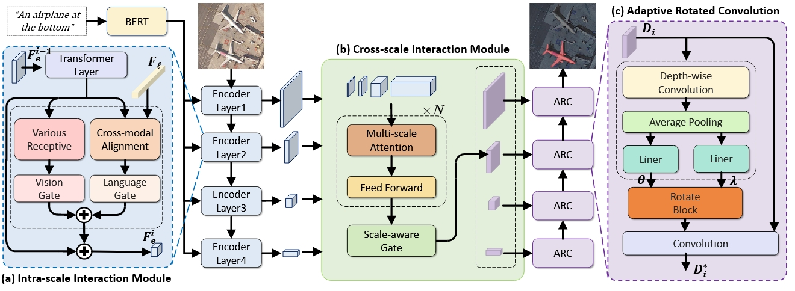|__Rotated Multi-Scale Interaction Network for Referring Remote  Sensing Image Segmentation__|__CVPR 2024__|[`Paper`](https://openaccess.thecvf.com/content/CVPR2024/papers/Liu_Rotated_Multi-Scale_Interaction_Network_for_Referring_Remote_Sensing_Image_Segmentation_CVPR_2024_paper.pdf) [`Github`](https://github.com/Lsan2401/RMSIN)|
|2|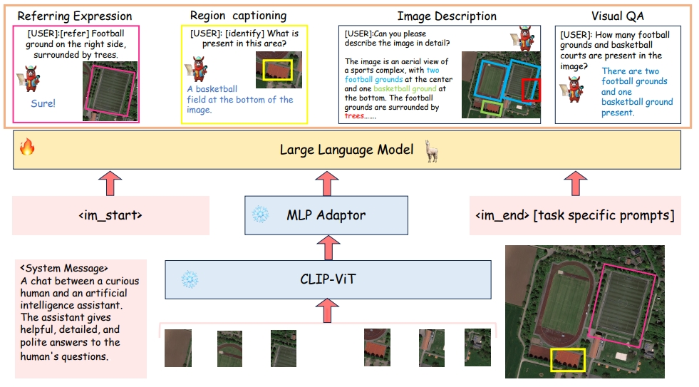|__GeoChat: Grounded Large Vision-Language Model for Remote Sensing__|__CVPR 2024__|[`Paper`](https://arxiv.org/pdf/2311.15826) [`Github`](https://github.com/mbzuai-oryx/geochat)|
|1|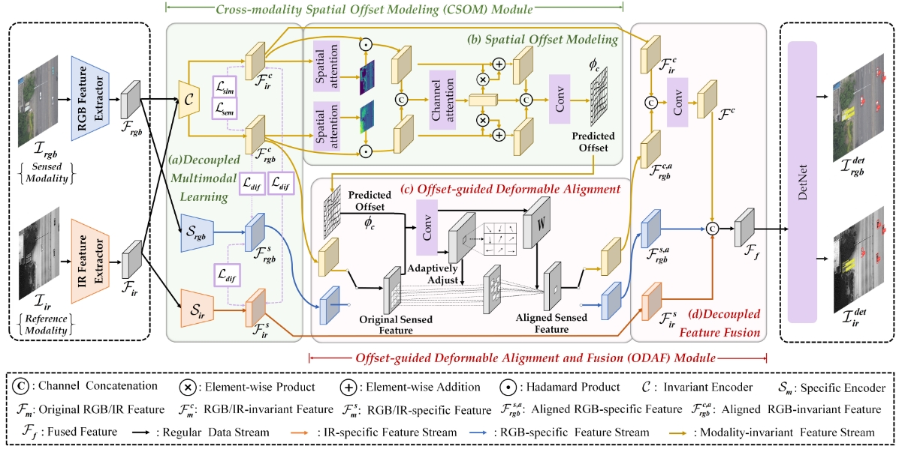|__Weakly Misalignment-free Adaptive Feature Alignment for UAVs-based  Multimodal Object Detection__|__CVPR 2024__|[`Paper`](https://openaccess.thecvf.com/content/CVPR2024/papers/Chen_Weakly_Misalignment-free_Adaptive_Feature_Alignment_for_UAVs-based_Multimodal_Object_Detection_CVPR_2024_paper.pdf)|
